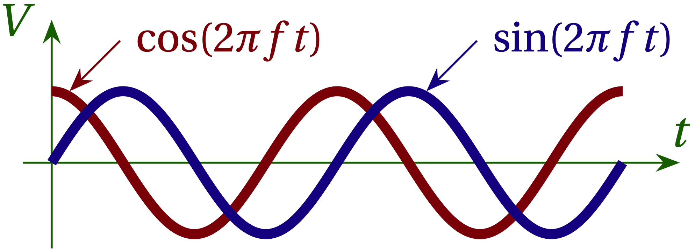

# Key Concepts and Where They are Introduced

+ [Mathematics](#mathematics)
+ [Digital Signal Processing](#digital-signal-processing)
+ [GNU Radio Blocks](#gnu-radio-blocks)

## Mathematics

Radio signals boil down to complex voltages that oscillate in time. They can be represented as superpositions (sums) of sines and cosines with different amplitudes and frequencies. In polar representation, they have different amplitudes and phases.

 Click to expand 

+ Sines and cosines are just shifted versions of one another: $$\cos(2\pi ft) = \sin(2 \pi ft + \pi/2)$$. The sum of a sine and a cosine with the same frequency may be expressed as either a sine or cosine with a suitable phase offset:
\begin{equation}
  A \cos(2\pi ft) + B \sin(2\pi f t) = C \cos(2\pi f t + \phi)
\end{equation}
where
\begin{align}
  C &= \sqrt{A^2 + B^2} \\\\ \tan\phi &= B/A
\end{align}

  

**Figure 1** --- A sine curve (blue) has the same shape as a cosine curve (red); it's just delayed by a quarter period. So, by adding a quarter period ($$\pi/2$$) to the argument of the sine function, we obtain the cosine function.

+ The relationship between sines & cosines and complex exponentials [(Euler's identity, Lesson 3a)](lesson03a.md){:target="_link"}
+ Representing complex numbers in polar form greatly simplifies [complex multiplication (Lesson 3a)](lesson03a#multiplying-complex-numbers-in-polar-form){:target="_link"}
+ The product of two sinusoidal functions with frequencies $$f$$ and $$f_0$$ is [the sum of sinusoids at frequencies $$f+f_0$$ and $$f-f_0$$ (Lesson 3b)](lesson03b.md){:target="_link"}.

+ Periodic signals with period $$T$$ may be expressed as a **Fourier series**:
\begin{equation}\label{eq:Fourier-series}
  V(t) = a_0 + \sum_{n=1}^{\infty} \bigg[ a_n \cos\bigg(\frac{2\pi n t}{T}\bigg) + b_n \sin\bigg(\frac{2\pi n t}{T}\bigg) \bigg]
\end{equation}
where the amplitude coefficients $$a_n$$ and $$b_n$$ can be determined by integration:
\begin{align}
  a_0 &= \frac{1}{T} \int_0^T V(t) \; dt \\\\  a_n &= \frac{2}{T} \int_0^T V(t) 
  \cos\bigg(\frac{2\pi n t}{T}\bigg)\;dt \\\\ b_n &= \frac{2}{T} \int_0^T V(t)
  \sin\bigg(\frac{2\pi n t}{T}\bigg)\;dt
\end{align}
See [Lesson 7](lesson07){:target="_link"} for lots more details.

+ Virtually any signal $$V(t)$$ that is a function of time $$t$$ may be expressed instead as a function of frequency using a **Fourier transform**:
\begin{align}
  \widetilde{V}(f) &= \int_{-\infty}^{\infty} V(t) e^{-i 2\pi f t}
   \; dt \\\\ V(t) &= \int_{-\infty}^{\infty} \widetilde{V}(f) e^{i 2\pi f t} \; df
\end{align}
Both the time version $$V(t)$$ and the frequency version $$\widetilde{V}(f)$$ carry the complete information about the signal. See [Lesson 7](lesson07){:target="_link"} for details.

## Digital Signal Processing

 Click to expand 

+ Any signal in time may be represented as a superposition (sum) of sinusoidal functions of various frequencies; the Fourier transform maps the representation in time to the representation in frequency, and vice versa.
+ The power in a sinusoidal signal is proportional to the **square** of its **amplitude** (in volts, for example).
+ Signals as a function of frequency are typically displayed using a logarithmic scale in **decibels**. Suppose signal 1 has amplitude $$A_1 = 1$$ and signal 2 has amplitude $$A_2 = 10^{-2}$$. We may express the strength of $$A_2$$ with respect to $$A_1$$ as $$A_2/A_1 = 0.01$$. In decibels, the amplitude ratio would be expressed
\begin{equation}
    \frac{A_2}{A_1} = -10 \log_{10} (0.01) = 20\text{ dB}
\end{equation}
That is, the decibel expression for the *amplitude ratio* is ten times the negative base-10 logarithm of the amplitude ratio. Because the power in a signal is proportional to the *square of its amplitude*, the decibel expression for the power in signal 1 compared to signal 2 is
\begin{equation}
  P_2 / P_1 = 20 \log_{10} (A_2/A_1)
\end{equation}
amplitudes that differ by a factor of 10 In a GNU Radio flow diagram, a **QT Frequency Sink** shows the power in the signal it displays as a function of frequency using decibels.
+ [A low-pass filter](lesson03b#low-pass){:target="_link"} transmits frequencies below a corner frequency without attenuation (nearly), but attenuates frequencies above the corner frequency more strongly the farther they are above the corner frequency. If you know something about resistors and capacitors, the circuit shown in Fig. 2 illustrates a simple low-pass filter.

  

**Figure 2** --- Since a capacitor is a "short-circuit" at high frequency, high-frequency signals will be strongly attenuated. On the other hand, at low frequencies a capacitor is like an open circuit (it charges up to the applied voltage), so $$V_{\rm out} \approx V_{\rm in}$$ (meaning that the low-frequency signal passes through unattenuated). The corner frequency represents the dividing line between the two behaviors. It is given by $$f_{\rm corner} = \frac{1}{2\pi RC}$$.

## GNU Radio

The complete list of blocks is available [on the GNU Radio page](https://wiki.gnuradio.org/index.php/Category:Block_Docs){:target="_gnu"}.

### Variable types

GNU Radio variables come in several different data types, which are indicated by the color of the tab that represents them on a flow diagram:

  - **blue: complex floating point**
  - **orange: floating point**
  - **green: integer**
  - **yellow: short integer**
  - **byte: byte**

Constant variable values may be declared in a **Variable** block. Adjustable values are typically represented with a **QT GUI Range** block. In either case, you set the variable type from the list shown above (although Range blocks cannot handle complex values).

### Blocks

- **Source** blocks emit signals via their output port(s)
- **Sink** blocks accept signals via their input port(s)
- **Include** blocks load Python modules so their functions and objects can be accessed by other blocks on the Flow Diagram.
- **Processing** blocks take one or more inputs and yield one or more outputs.

### Radio Transmitters and Receivers

- **RTL-SDR Source**
- **RTL-SDR Sink**
- **Pluto-SDR Source**
- **Pluto-SDR Sink**

#### User Interaction and Display

Graphical user interface (GUI) blocks either accept input from a user with a graphical representation of an analog input or display information in graphical or text format.

+ **QT GUI blocks** display information graphically when the flow diagram runs. The blocks we use include:
   - **QT GUI Range**: a slider that allows the user to adjust a variable's value [Lesson 1](lesson01.md){:target='_link'}
   - **QT GUI Time Sink**: a graph that displays one or more input signals as functions of time. [Lesson 1](lesson01.md){:target='_link'}
   - **QT GUI Frequency Sink**: a graph that displays one or more input signals as functions of frequency on a decibel (logarithmic) scale. [Lesson 1](lesson01.md){:target='_link'}
   - **QT GUI Constellation Sink**: a plot showing the real part of a signal on the <em>x</em> axis and the imaginary part on the <em>y</em> axis.
    (sliders, time sinks, frequency sinks, constellation sinks, eye sinks)
+ **WBFM Receive**: input is the downconverted complex baseband (complex) signal and the output is the demodulated audio (float). [Lesson 1](lesson01.md){:target='_link'}
+ **Audio Sink** passes a signal to the computer's sound card. Note that a maximum input frequency for audio cards is typically 48 kHz. [Lesson 1](lesson01.md){:target='_link'}

+ Translation (Chunks to Symbols, Repeat, Vector Source)
+ Arithmetic blocks
+ Include blocks
+ SDR inputs and outputs
+ Filters (High-pass, low-pass, interpolating, root raised cosine)
   - **Low Pass Filter** [Lesson 1](lesson01.md){:target='_link'}
+ Signal Source
+ Repeat
+ Skip Head
+ Throttle --- used only in simulation graphs where no "real" signal is used from a hardware device.
+ AGC --- automatic gain control
+ FLL Band-Edge --- frequency-locked loop, used to correct for the (small) discrepancy between the clocks in different devices.
+ Constellation Modulator
+ Random Uniform Source
+ Symbol Sync
+ Costas
