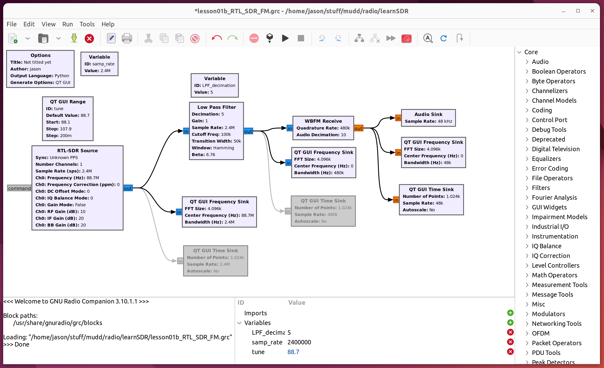
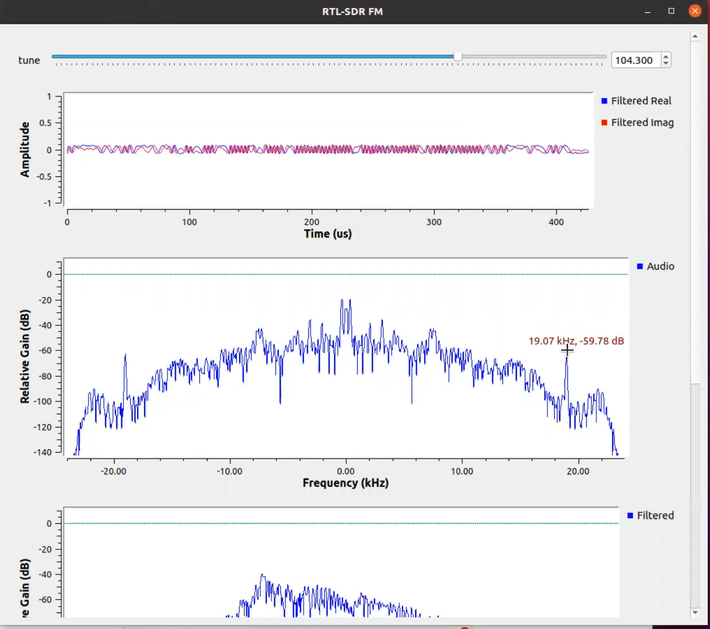

# Lesson 1 --- FM broadcast receiver with RTL-SDR

<iframe width="560" height="315" src="https://www.youtube.com/embed/tj_9p_rXULM" title="YouTube video player" frameborder="0" allow="accelerometer; autoplay; clipboard-write; encrypted-media; gyroscope; picture-in-picture" allowfullscreen></iframe>

## GNURadio Flowgraphs and Output

[Open in a new window ](figs/flow/RTL-SDR-FM.png){:target="new_"}

[Open in a new window ](figs/run/RTL-SDR-FM.png){:target="new_"}

## Recommendations for Working with SDR
* If setting up an antenna, try to keep it from either laying down on the table or from touching anything. Weird patterns will show up otherwise.
* Organize and keep cords wrapped around things - as your work starts to grow bigger, it's harder to keep track of everything, so make sure you start out as organized as possible. Put labels on things, if you need to.

All GNURadio flowgraphs are at [https://github.com/gallicchio/learnSDR](https://github.com/gallicchio/learnSDR)

