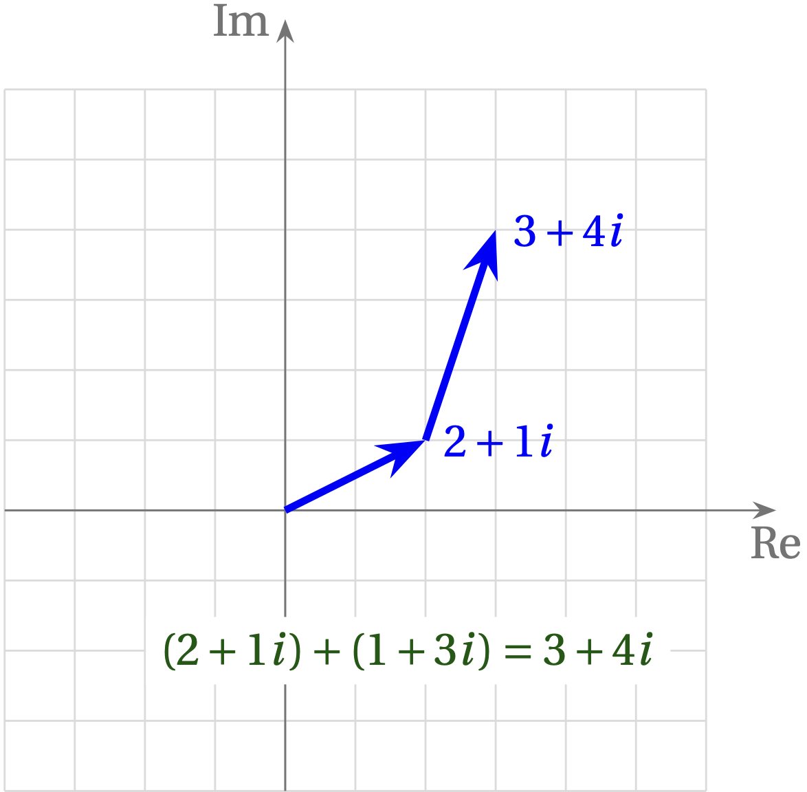
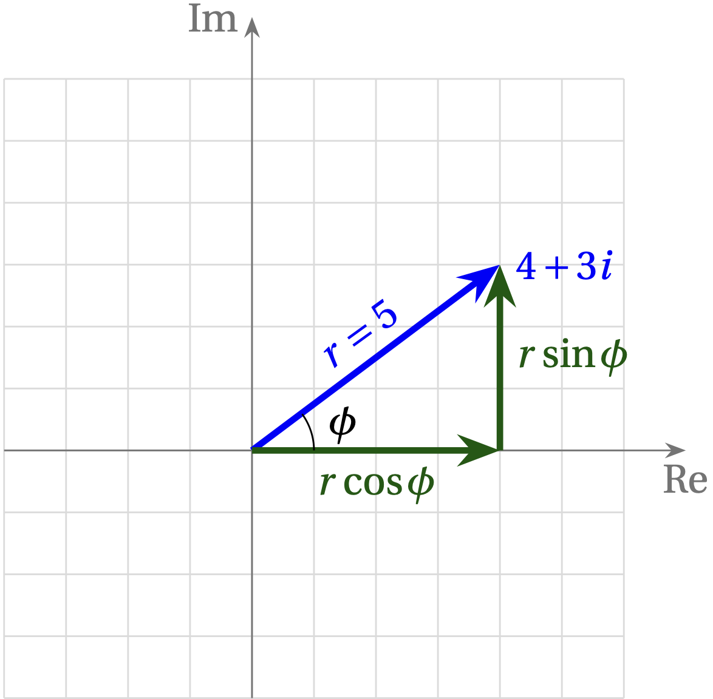

# Lesson 3 --- Complex Numbers in Software-Defined Radio

Although a radio signal is inherently a real thing---the electric field has a real magnitude and direction at a given point in space and time---the frequency shifting inherent in radio inherently introduces complex numbers, as we will see. So, to prepare, let's review some basic properties of complex numbers.

In general, a complex number has a real part and an imaginary part: $$z = x + iy$$, where $$x$$ and $$y$$ are real numbers and $$i = \sqrt{-1}$$. To add two complex numbers, just add the real parts and add the imaginary parts. For example, to add $$2+1i$$ and $$1 + 3i$$, add the real parts ($$2+1=3$$) and add the imaginary parts ($$1i + 3i = 4i$$). The result is $$3 + 4i$$.

A very useful way to visualize this process is to represent complex numbers with their real part along the $$x$$ axis and their imaginary part along the $$y$$ axis. This same addition problem is illustrated in the following figure.

{: width="300px" height="300px"}

## Multiplying Complex Numbers

You can multiply two complex numbers just the way you would algebraic expressions:
\begin{align}
  (a+b)\times(c+d) &= ac + bd + ad + bc \\
  (2+1i) \times (3+4i) &= 2\times3 + (1i)\times(4i) + 2\times4 i + 1i\times 3\\
  &= (6-4) + (8+3)i = 2 + 11 i
\end{align}
where we have used that $$i^2=-1$$. This is just the approach the computer uses, but we will see that multiplication gets simpler when we use polar form for complex numbers.

## Polar Form

{: width="300px" height="300px"}

## Euler's Identity

## Complex Sinusoids

## Illustrations in GNU Radio

- time sinks
- frequency sinks
- constellation plots

## Negative Frequencies
