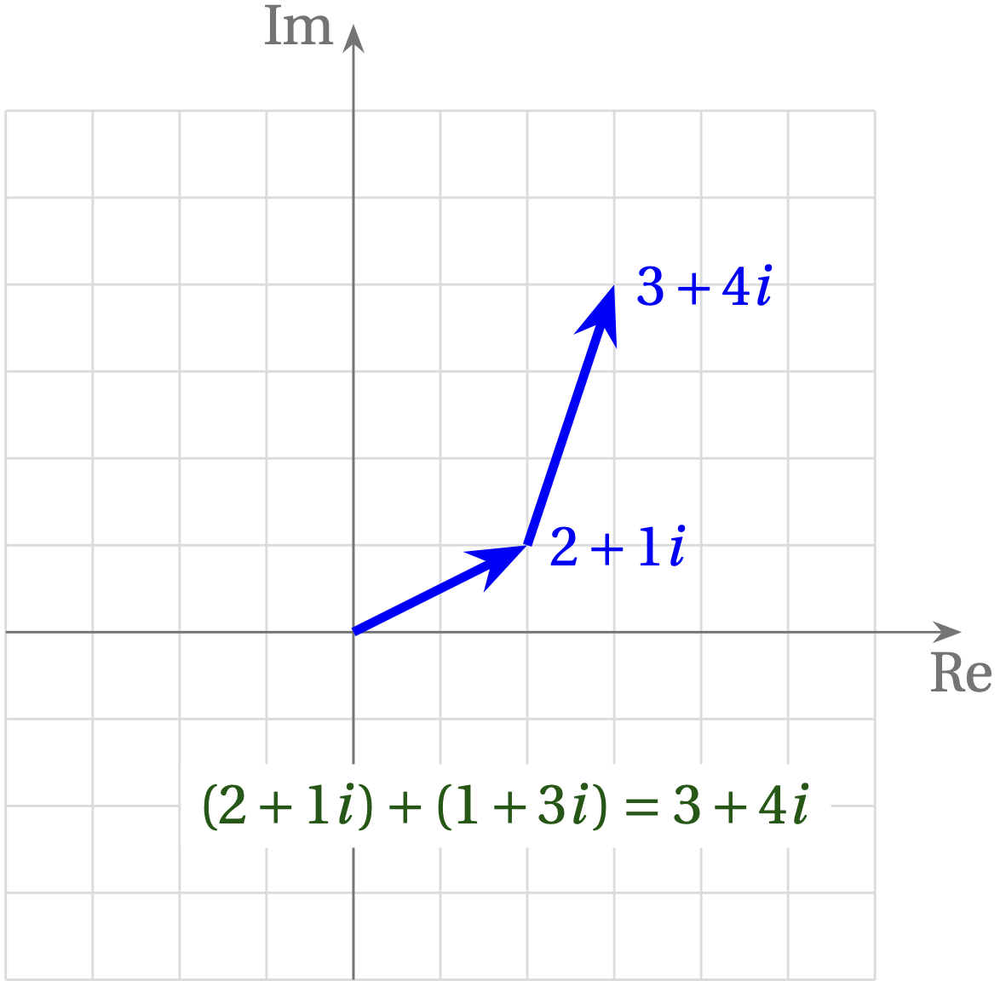

# Lesson 3a --- Complex Numbers in Software-Defined Radio

Although a radio signal is inherently a real thing---the electric field has a real magnitude and direction at a given point in space and time---the frequency shifting inherent in radio inherently introduces complex numbers, as we will see. So, to prepare, let's review some basic properties of complex numbers.

In general, a complex number has a real part and an imaginary part: 

 $$z = x + iy$$, 

where $$x$$ and $$y$$ are real numbers and $$i = \sqrt{-1}$$

To add two complex numbers, just add the real parts and add the imaginary parts. For example, to add $$2+1i$$ and $$1 + 3i$$, add the real parts ($$2+1=3$$) and add the imaginary parts ($$1i + 3i = 4i$$). The result is $$3 + 4i$$.

<!-- {:target="_blank"} -->

<iframe width="560" height="315" src="https://www.youtube.com/embed/2BhuW1stMYo" title="YouTube video player" frameborder="0" allow="accelerometer; autoplay; clipboard-write; encrypted-media; gyroscope; picture-in-picture" allowfullscreen></iframe>

______________________________________________________________________________________________________________________________________________________________

# Homework from the video
1. Look at a real cosine value. You should be able to add a complex conjugate of the cosine wave to the original cosine wave. 
  Remember that
  \begin{equation}
    (a + bi) + (a - bi) = 2a
  \end{equation}
  where a is the real part of the cosine wave. Remember that the constellation graph should only have real values; the dot should never move in the $$i$$ direction.
2. Examine the other waveforms that are options in the sources. Specifically, look at a square, a triangle, and a sawtooth graph of cosine. Take note of harmonics in the frequency graph of these waveforms. Make sure you can identify which type of harmonics each of these waveforms make in the frequency graph.
3. Generate two complex exponential frequencies, multiply them together, and plot the result. You should see that the frequency is the sum of the two frequencies. Mathematically, this is
  \begin{equation}
    e^{i2 π f_1 t} x e^{i2 π f_2 t} = e^{i2 π (f_1 + f_2) t}
  \end{equation}
  It should be easiest to see this effect when you make one of the frequencies quite small in comparison to the other.
4. Multiply two real exponential frequencies, similar to what you did in Homework 3.
5. Take a real cosine, and plot the following:
  \begin{equation}
    \cos(2 π f t)
  \end{equation}
  \begin{equation}
    \abs(\cos(2 π f t)
  \end{equation}
  \begin{equation}
    \arctan(\cos(2 π f t))
  \end{equation}
  Some useful functions for this homework are "Multiply Const", "Transcendental", and "Abs". You can also change the number of inputs into the QT Gui Frequency Sink and the QT GUI Time Sink in order to display multiple graphs at the same time. For Homework 5, you should need 3 inputs in both the time sink and the frequency sink: one for each equation.
  To multiply by pi, use the "import" block. Import the math module the same way you would in Python, and you can then call math.pi.
    

A very useful way to visualize this process is to represent complex numbers with their real part along the $$x$$ axis and their imaginary part along the $$y$$ axis. This same addition problem is illustrated in the following figure.

## Multiplying Complex Numbers

You can multiply two complex numbers just the way you would algebraic expressions (using FOIL, but I will change the order to FLOI for "firsts-lasts-outside-inside"):
\begin{equation}
  (a+b)\times(c+d) = ac + bd + ad + bc 
\end{equation}
Similarly,
\begin{equation}
  (2+1i) \times (3+4i) = (2\times3) + (1i\times 4i) + (2\times4 i) + (1i\times 3)
\end{equation}
\begin{equation}
  = (6-4) + (8+3)i = 2 + 11 i
\end{equation}
where we have used that $$i^2=-1$$. This is just the approach the computer uses, but we will see that multiplication gets simpler when we use polar form for complex numbers.

Do you see why I changed the order in "FOIL"?

 Click to expand 

The product of the *lasts* yields a real number, since $$i^2=-1$$, so it helps to put it next to the product of the *firsts*, which is also real. The *outsides* and the *insides* yield imaginary terms.

## Polar Form

The polar form of a complex number uses the "length" of the number and its orientation angle with respect to the real axis to specify the number, rather than its real and imaginary components. To express the complex number $$4 + 3i$$ in polar form, examine the figure below.

Using the Pythagorean theorem, we can compute the length of the hypotenuse, which is the magnitude $$r$$ of the number:
\begin{equation}
  r = \sqrt{4^2 + 3^2} = \sqrt{25} = 5
\end{equation}
We could also express the phase angle $$\phi$$ using the definition of tangent, which is opposite over adjacent:
\begin{equation}
  \tan\phi = \frac{3}{4} \qquad\text{or}\qquad \phi = \arctan(3/4) \approx 36.9°
\end{equation}

## Euler's Identity

There is a most beautiful mathematical relationship known as **Euler's identity** that makes expressing complex numbers in polar form incredibly useful. It is
\begin{equation}
  e^{i\phi} = \cos\phi + i \sin\phi
\end{equation}
If you have learned about Taylor series, you can probably show that this is true, but if you haven't, don't worry. We will just use Euler's identity to express the complex number $$z = 4 + 3i$$ as
\begin{equation}
  z = r e^{i\phi}
\end{equation}

## Multiplying Complex Numbers in Polar Form
 
Why is this so great? Well, because when you multiply exponentials, you just add the exponents. So, if we have numbers $$z_1 = r_1 e^{i \phi_1}$$ and $$z_2 = r_2 e^{i \phi_2}$$, their product is
\begin{equation}
  z_1 \times z_2 = r_1 e^{i \phi_1} \times r_2 e^{i \phi_2} = r_1 r_2 e^{i(\phi_1+\phi_2)}
\end{equation}

- The magnitude of the product of the two complex numbers is the product of their magnitudes
- The phase of the product of two complex numbers is the sum of their phases

Put another way, complex multiplication rotates and stretches complex numbers.

**Exercise:** If $$z_1 = 3 e^{i 30°}$$ and $$z_2 = 4 e^{i 60°}$$, what is $$z_1 z_2$$? Work it out first in polar form, then try it in rectangular $$(x + iy)$$ form. You'll see why we love the polar version!

 Click to expand 

$$z_1 z_2 = 12 e^{i 90°} = 12 i$$

## Complex Sinusoids

What does a signal of the form $$A e^{i\;2\pi f t}$$ look like? According to Euler's identity, it is
\begin{equation}
  A e^{i\;2\pi f t} = A \cos(2\pi f t) + i A \sin(2\pi f t)
\end{equation}
In other words, the real part is a cosine wave with amplitude $$A$$ and frequency $$f$$. The imaginary part is a sine wave with the same amplitude and frequency. By default, GNU Radio shows the real part in blue and the imaginary part in red. So, a plot of a pure "cosine" wave, when passed to a **QT GUI Time Sink** appears as in the figure below.

Note that the blue (real) part starts at 1 and is a cosine wave, whereas the red (imag) part starts at 0 and rises with increasing time. **What is the frequency of this source?**

 Click to show the answer 

The period of the wave is 1 ms, so the frequency is 1 kHz.

All GNURadio flowgraphs are at [https://github.com/gallicchio/learnSDR](https://github.com/gallicchio/learnSDR)

[Lesson 3b](lesson03b.md)

