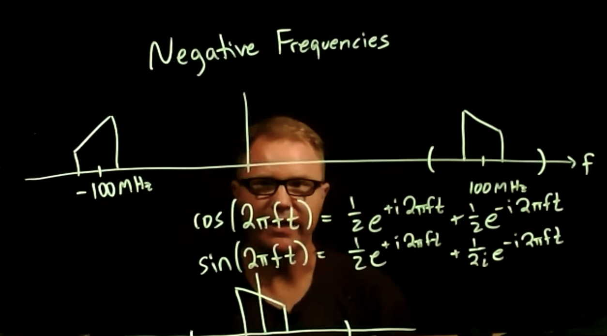

# Lesson 3b --- Negative Frequencies

<!-- {:target="_blank"} -->

<iframe width="560" height="315" src="https://www.youtube.com/embed/DDsteHP7sFg " title="YouTube video player" frameborder="0" allow="accelerometer; autoplay; clipboard-write; encrypted-media; gyroscope; picture-in-picture" allowfullscreen></iframe>

 

*Yes, but why do we care? Real electrical signals are **real**, aren't they?*

Well, yes, they are. As you can verify from **Euler's identity**, 
\begin{equation}\label{eq:Euler}
 e^{i \phi} = \cos\phi + i \sin\phi
\end{equation}
 we can express the cosine of $$\phi$$ as
\begin{equation}
  \cos \phi = \frac{1}{2} (e^{i\phi} + e^{-i\phi})
\end{equation}
for any phase $$\phi$$, including $$\phi = 2\pi f t$$. That is, a real cosine wave is composed of equal parts of positive and negative frequencies:
\begin{equation}
  \cos(2\pi f t) = \frac{1}{2} ( e^{i\,2\pi f t} + e^{-i \,2\pi f t})
\end{equation}

When a software-defined radio *mixes* such a wave with a high-frequency carrier, it multiplies the cosine wave by a signal of the form $$2 e^{-i 2\pi f_0 t}$$. That produces
\begin{equation}
  2\cos(2\pi f t) e^{-i 2\pi f_0 t} = [ e^{i\,2\pi (f-f_0) t} + e^{-i \,2\pi (f+f_0) t}]
\end{equation}
The first term oscillates at the difference frequency $$f - f_0$$, and the second oscillates at the sum frequency $$f + f_0$$. For frequencies $$f$$ close to the carrier frequency $$f_0$$, the difference frequency will be *much* lower than the sum frequency. The second term oscillates at almost twice the carrier frequency. Passing the result through a **low-pass filter**, which strongly attenuates high frequencies, effectively removes the second term, leaving just $$ e^{i\,2\pi (f-f_0) t} $$, which is clearly a **complex sinusoidal signal**. Thus, the frequency shifting done by a software-defined radio necessarily generates complex signals.

## Illustrations in GNU Radio

- time sinks
- frequency sinks
- constellation plots

## Exercises

1. The Taylor series for the exponential function is
\begin{equation}\label{eq:exposeries}
  e^x = 1 + x + \frac{x^2}{2!} + \frac{x^3}{3!} + \cdots
\end{equation}
where $$3! = 3\times 2\times 1 = 6$$ and $$n! = n (n-1) (n-2) \cdots (2) (1)$$ is the factorial of $$n$$. 

    a. Using this expression, show that $$\frac{d e^x}{dx} = e^x$$, an important property of the exponential function.

    b. The Taylor series for sine and cosine are
    \begin{equation}
      \sin x = x - \frac{x^3}{3!} + \frac{x^5}{5!} - \cdots
    \end{equation}
    \begin{equation}
      \cos x = 1 - \frac{x^2}{2!} + \frac{x^4}{4!} - \cdots
    \end{equation}
    Use these three Taylor series to show Euler's identity,
    \begin{equation}
      e^{i\phi} = \cos\phi + i \sin\phi
    \end{equation}
    by substituting $$i\phi$$ for $$x$$ in the Taylor series for the exponential, Eq. \eqref{eq:exposeries}.
