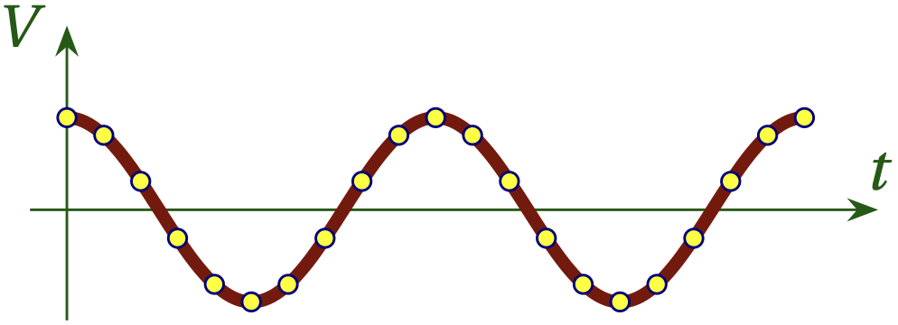
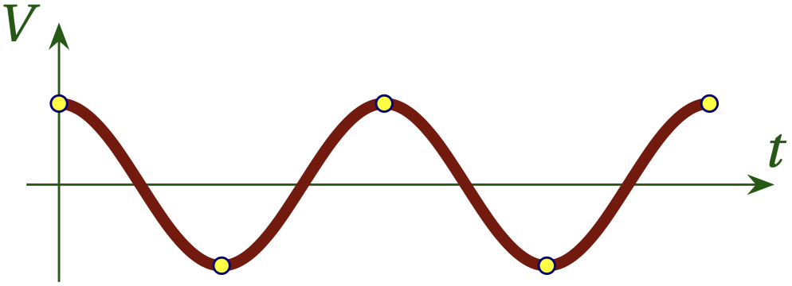
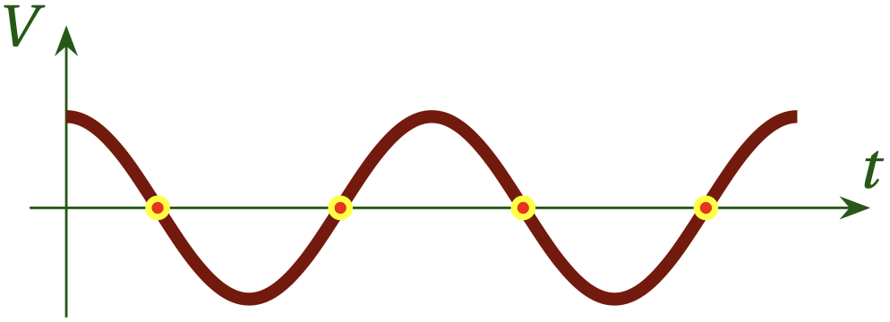
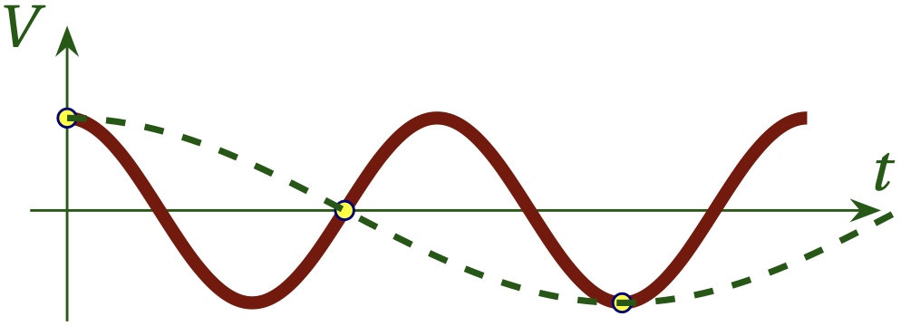

# Lesson 6 --- Sampling

<iframe width="560" height="315" src="https://www.youtube.com/embed/gVd9JG8JaCQ" title="YouTube video player" frameborder="0" allow="accelerometer; autoplay; clipboard-write; encrypted-media; gyroscope; picture-in-picture" allowfullscreen></iframe>

 

A software-defined radio uses **analog-to-digital converters (ADCs)** to sample a real signal at a regular cadence, as illustrated in Fig. 1. The question we now need to consider is this: under what conditions can we convert our discrete samples back into the original continuous signal?

  

**Figure 1** --- A continuous signal sampled many times per cycle.

## The Nyquist-Shannon Sampling Theorem

Real-world signals are continuous in time, but digital data is discrete: an **analog-to-digital converter (ADC)** converts a real voltage at time $$t$$ into a digital representation with a certain resolution (typically 8 bits or more) and the signal is next sampled some time $$T_s$$ later at $$t + T_s$$. The infinite number of signal values for all the moments of time between $$t$$ and $$t+T_s$$ are not recorded and it would seem reasonable that they are lost forever. Amazingly, the **Nyquist-Shannon sampling theorem** allows us to use the discrete comb of sampled values with sampling interval $$T_s$$ into a continuous version of the signal that is  **an exact replica** of the original continuous source, provided certain conditions are satisfied.

Clearly, there must be a minimum sampling rate if we are to have any hope of reproducing the original signal. You might think that we need to have many samples per cycle, as in Fig. 1, but the **Nyquist-Shannon sampling theorem** states that provided we have _more than_ two samples per cycle, we can achieve a perfect reproduction of the original signal. Figure 2 illustrates how this might seem plausible, but had we gotten unlucky and sampled every time this same signal passes through zero, as shown in Fig. 3, we wouldn't be able to distinguish this signal from no signal at all! That is why we need (slightly) more than two samples per cycle to make sure we don't fall into the trap that Fig. 3 illustrates.

  

**Figure 2** --- A continuous signal sampled only twice per cycle.

  

**Figure 3** --- A continuous signal sampled many times per cycle.

## Undersampling

The **Nyquist frequency** for a sinusoidal signal of frequency $$f$$ is $$f_{N} = 2 f$$, and the sampling theorem states that provided that
\begin{equation}
    \frac{1}{T_s} > f_N \qquad\text{or}\qquad
    T_s < \frac{1}{2 f}
\end{equation}
we can achieve a perfect reproduction of the original continuous signal from the discrete samples. To illustrate what goes wrong when we don't sample at a frequency above the Nyquist frequency, consider Fig. 4, which shows that a faster signal that is sampled at less than twice per period actually appears like a significantly slower signal. We say that frequencies above the Nyquist frequency are **aliased** to frequencies below the Nyquist frequency.

  

**Figure 4** --- If we sample more slowly than the Nyquist frequency, the true signal (shown in red) will appear to have a much lower frequency, as shown in the dashed green curve. This is called **aliasing**.

If you have seen the spokes of a wagon wheel appear to move backward in a movie, you have seen an illustration of aliasing. Suppose the movie were shot at 24 frames per second and that the while was rolling at just the right speed so that in 1/24 s, each spoke rotated into the position occupied by its neighbor in the previous frame. In that case, the spokes would appear not to move at all, which is akin to the situation illustrated in Fig. 3. If, on the other hand, in 1/24 s the whole rotates so that spokes almost make it to the position of their neighbor in the prior frame, but not quite, then it will appear as if the spokes are rotating slowly backward.

**Question** --- A wagon wheel with 12 spokes and a diameter of 3 feet is filmed at 24 frames per second. How fast does the wagon need to be moving (and the wheel rolling) for the spokes to appear to rotate backward at one-tenth the rate that they are actually rotating forward?

## Homework

 1. Start a new flow graph and use a complex signal source. Show that when you go too fast for the Nyquist-Shannon theorem to hold, the resulting frequency wraps around from positive to negative.
