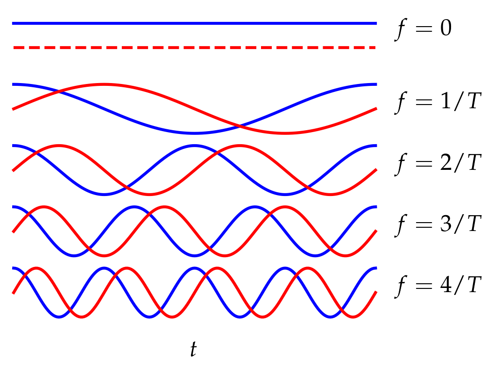
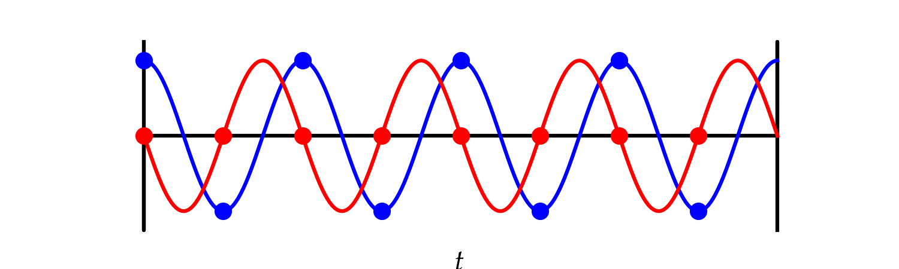

# Lesson 7 --- Frequency Spectra, Fourier Transforms, and the Fast Fourier Transform (FFT)

<iframe width="560" height="315" src="https://www.youtube.com/embed/lHkcjLzc208" title="YouTube video player" frameborder="0" allow="accelerometer; autoplay; clipboard-write; encrypted-media; gyroscope; picture-in-picture" allowfullscreen></iframe>

 

Our method of analyzing signals rests on an insight developed by Joseph Fourier and remains associated with his name. Namely, any "reasonable" periodic signal of period $$T$$ may be represented as a weighted sum of sines and cosines whose frequencies are integer multiples of $$f = 1/T$$. Figure 1 illustrates a few of the lowest-frequency "**modes**" that can be combined to produce an arbitrary function on the interval $$0 \le t \le T$$ (and repeating thereafter).

  

**Figure 1** --- A signal may be decomposed into a sum of sines and cosines with frequencies that are integer multiples of a chosen time interval $$T$$. A Fourier decomposition of the signal determines the amplitude of each of the sines and cosines.

In an important way, each of these modes is like a unit vector in an infinite dimensional space (in principle, there is no maximum frequency); they are all orthogonal in the sense that 
\begin{align}
  \int_0^T \sin\bigg(\frac{2\pi m t}{T}\bigg) \, \cos \bigg(\frac{2\pi n t}{T}\bigg)  \, \mathrm{d}t &= 0 \\\\ \int_0^T \sin\bigg(\frac{2\pi m t}{T}\bigg) \, \sin\bigg(\frac{2\pi n t}{T}\bigg) \, \mathrm{d}t &= \frac12\delta_{m n} \\\\ \int_0^T \cos\bigg(\frac{2\pi m t}{T}\bigg) \, \cos\bigg(\frac{2\pi n t}{T}\bigg)  \, \mathrm{d}t &=  \delta_{mn}  \times \begin{cases} \frac12 & m \ne 0 \\\\ 1 & m = n = 0 \end{cases}
\end{align}
where the Kronecker delta $$\delta_{m n}$$ is 1 when $$m = n$$ and zero otherwise.

## Discrete sampling

As discussed in the previous lesson, when the continuous signal is sampled at sampling interval $$T_s$$, the Nyquist frequency defined by 
\begin{equation}
  f_N = \frac{1}{2T_s}
\end{equation}
is the fastest frequency that we can represent. If the continuous signal has frequency components at frequencies greater than the Nyquist frequency, discrete sampling *aliases* these signals into the range $$f < f_N$$, as illustrated in Fig. 2 (which is copied from Lesson 6).

  

**Figure 2** --- If we sample more slowly than the Nyquist frequency, the true signal (shown in red) will appear to have a much lower frequency, as shown in the dashed green curve. This is called **aliasing**.

We will assume in the following that the signal *does not* have frequency components above the Nyquist frequency.

For a real signal, we only need positive frequencies. With radio signals that are frequency shifted to lower frequencies by mixing with a high-frequency local oscillator, we need both positive and negative frequencies, as discussed in [Lesson 3b](lesson03b.md). In this case, the modes have the form
\begin{equation}
  e^{i 2\pi f_n t} \qquad\text{where}\qquad -\frac{1}{4T_s} \le f_k < \frac{1}{4 T_s}
\end{equation}
where $$k$$ is an integer mode "index". What defines how many modes there are and what frequencies they have?

Let's take a simple example where we sample N=8 times. That is, $$T = 8 T_s$$. For a mode to be periodic in this interval, it must go through an integer number of complete cycles. That is, we require
\begin{equation}
  e^{i 2 \pi f_k T} = 1\qquad\text{or}\qquad 2 \pi f_k N T_s = 2\pi k
\end{equation}
for integers $$k$$. That is,
\begin{equation}
  f_k = \frac{k}{N T_s}
\end{equation}
Clearly, $$k=0$$ works and generates a constant function. Next we have $$k=\pm1, \pm2, \pm3$$, which adds six more modes. There is one more mode that works in this example, which is $$k = -4$$. It has no companion $$k = 4$$. Why not? Let's look at this mode.

  

**Figure 3** --- The mode with $$k = -4$$. Notice that the samples of the imaginary part of the signal, shown in the red circles, is always zero. A plot of the mode with $$k = 4$$ would have the blue and red dots in exactly the same spots; these are really the same mode when we sample discretely.

As Fig. 3 illustrates, $$k = N/2$$ yields exactly the same mode as $$k = -N/2$$. Therefore, the discrete frequencies yielded by the Fourier transform in this simple example are
\begin{equation}
  -4\frac{2\pi}{8T_s},-3\frac{2\pi}{8T_s},-2\frac{2\pi}{8T_s},-\frac{2\pi}{8T_s},0,\frac{2\pi}{8T_s},2\frac{2\pi}{8T_s},3\frac{2\pi}{8T_s}
\end{equation}
or
\begin{equation}
  f_k = \frac{2 \pi k}{N T_s} \qquad -\frac{N}{2} \le k < \frac{N}{2}
\end{equation}

## Power spectra

In a Fourier series of a complex signal, the complex modes have complex amplitudes. That is, we represent the sampled signal as
\begin{equation}\label{eq:csum}
  f(nT_s) = \sum_{k = -N/2}^{k=N/2-1} c_k e^{i 2\pi k n/N}
\end{equation}
where the coefficients $$c_k$$ have both real and imaginary parts and we have noted that when $$t = n T_s$$, the $$f_k t = 2\pi k n /N$$. You might be worried that the representation in Eq. \eqref{eq:csum} cannot represent a wave with arbitrary phase, since all the basis functions are 1 at $$t = 0$$. However, 
\begin{equation}
  e^{i \omega t + \phi} = e^{i\omega t} e^{i\phi}
  = e^{i\omega t}(\cos\phi + i\sin\phi)
\end{equation}
so by adjusting the phase of the complex coefficient $$c_k$$ we can represent a component at frequency $$f_k$$ with arbitrary phase.

The power in each mode is given by the amplitude squared, $$|c_k|^2$$. In a **GUI Frequency Sink**, the power is shown in decibels,
\begin{equation}
  P_k = 10 \log_{10} |c_k|^2 = 20 \log_{10} |c_k|
\end{equation}
which allows us to represent a broad dynamic range of signal powers on a single graph.

## Fast Fourier Transform (FFT)

The fast Fourier transform is an efficient way of computing the coefficients $$c_k$$ in Eq. \eqref{eq:csum} from the $$N$$ signal values $$f_n = f(n T_s)$$ for $$n = 0,$$ $$1, \ldots,$$ $$N-1$$. First we note that the complex modes have a slightly different orthogonality relation that involves multiplying by the complex conjugate (and summing over the $$N$$ samples, instead of integrating since we have discrete data). 
\begin{equation}\label{eq:orthogonality}
  s_{k k'} = \sum_{n=0}^{N-1} \exp(i 2\pi k' n/N) \exp(-i 2\pi k n/N)
  = \sum_{n=0}^{N-1} r^n
\end{equation}
where $$r = \exp[i 2\pi (k'-k)/ N]$$. This is just a geometric series that we can sum with the formula
\begin{equation}\label{eq:geom}
  s_{k k'} = \frac{1 - r^N}{1-r}
\end{equation} provided that $$r \ne 1$$. But when $$k' \ne k$$, the numerator in Eq. \eqref{eq:geom} goes to zero, so the sum vanishes.
Of course, when $$k = k'$$ the value of $$r$$ is just one, so the sum yields $$N$$. Hence,
\begin{equation}
  s_{k k'} = N \delta_{k k'}
\end{equation}
So, to figure out $$c_k$$ in Eq. \eqref{eq:csum}, we multiply both sides by $$\exp(-i 2 \pi k n/N)$$ and sum over $$n$$:

\begin{equation}\label{eq:findingck}
  \sum_{n=0}^{N-1} f_n e^{-i 2 \pi k n/N} = N c_k
\end{equation}
That is, we can find $$c_k$$ by $$N$$ multiplications of the $$f_n$$ values with a corresponding exponential and $$N-1$$ additions. Finally, we need one more division by $$N$$ to produce the desired coefficient. So, it would appear that we need to perform $$2N$$ arithmetic operations to calculate each of the $$N$$ coefficients $$c_k$$, for a total of $$2N^2$$ operations. Suppose we use $$N=1024 = 2^{10}$$ points in the transform. Then we're talking over 2 million operations to compute one transform.

The FFT algorithm uses a clever factorization strategy to lower the number of operations to a value proportional to $$N \log_2 N$$. For the 1024-point transform, this is a factor of about 100 fewer operations than the naive approach, since $$\log_2 (1024) = 10$$.

## Window functions

A common problem with discrete transforms is handling sinusoidal signals that "don't fit" in the window of duration $$T=N T_s$$. Because the Fourier series repeats with period $$T$$ and since the signal at $$t = T$$ is not equal to the signal at $$t = 0$$, such signals have a discontinuity at $$t = T$$, and this discontinuity means that there is a finite amplitude in every mode, according to the geometric series in Eq. \eqref{eq:geom} (where we now allow $$k'$$ to be nonintegral). Window functions allow us to minimize this unpleasantness. Their purpose is to gently ramp the amplitude down towards the ends of the interval (as $$t \to 0$$ and $$t \to T$$). The distortion caused by this modification to the true signal is less severe the greater the number $$N$$ of samples used to compute the FFT.

# Exercises

1. Investigate the role of FFT size on the spillover of power into frequency bins other than the maximum when using the rectangular window function and also when using one of the window functions that goes smoothly to zero at the boundaries of the interval.

2. It is proposed to avoid the broadening caused by window functions by sampling more frequently. Could this work? If so, how fine a sampling period would be required? If not, why not?