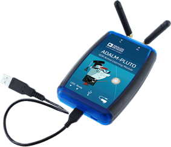

# Lesson 8a --- Transmit and Receive from a PlutoSDR

<iframe width="560" height="315" src="https://www.youtube.com/embed/GIdATdJi8jA" title="YouTube video player" frameborder="0" allow="accelerometer; autoplay; clipboard-write; encrypted-media; gyroscope; picture-in-picture" allowfullscreen></iframe>

In this project you will use a software-defined radio to send and receive a sine wave signal with frequency in the kilohertz range using a carrier frequency of 2.4 GHz. You will be able to control the attenuation of the transmitted signal, as well as the gain on the received signal. If the received signal is too strong, you will notice distortion of the sinusoidal oscillation in a time sink.

Besides **QT GUI Range sliders**, **QT GUI Time Sinks**, and **QT GUI Frequency Sinks**, the blocks you'll need are a **Signal Source**, **PlutoSDR Sink**, and **PlutoSDR Source**.

1. Screw in the two antennas to the Pluto's TX and RX ports, taking care not to damage the central pin of the SMA connectors. A good technique is to hold the antenna steady with one hand and gently rotate the screw until tight with the other hand. Orient the two antennas roughly parallel with each other.

2. The signal source should put out a complex cosine wave with an adjustable frequency tied to a range slider. Connect it to a time sink to visualize its output and also to the PlutoSDR sink, which will combine that signal with the carrier wave and broadcast it through the TX antenna. Label the traces in the time sink with **TX** or **transmit** so we can distinguish them from the received signal. See the parameter table below for the values to use in the PlutoSDR sink.

3. The PlutoSDR source needs to operate at the same frequency as the sink. Connect the PlutoSDR Source to a time sink and a frequency sink. Label the time sink traces with **RX** or **receive**.

## Equipment

- Analog devices ADALM-PLUTO software-defined radio 

## Parameters

| Parameter            | Value or Range                         |
| ----------------     | --------------:                        |
| sample rate          | 2.084 MS/s                             |
| tone frequency range | -100 kHz to 100 kHz, default of 50 kHz |
| RX gain              | 0 to 70, default of 64                 |
| RX gain mode         | manual                                 |
| Pluto LO frequency   | 2.4 GHz                                |
| TX attenuation       | 10 dB                                  |

[Lesson 8 flow diagram](figs/flow/lesson08-flowdiagram.png)

## Things to Explore

- How does the orientation of the two antennas affect the strength of the received signal?
- What happens when you set the tone frequency to 0? When you crank up the gain?
- If you place your hand near the Pluto, does it change the observed frequency signal?
- When the gain is high enough to cause noticeable distortion in the received signal, how do the distortions show up in the frequency plot (sink)?
- What happens if you leave the TX frequency at 2.4 GHz, but you change the Rx frequency to 2.41 GHz?
