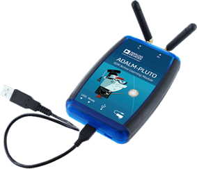

# Lesson 9 --- Pluto Doppler RADAR

When a radio wave bounces off a moving target, its frequency shifts. This shift is called the *Doppler effect*. Our goal in this project is to build a flow diagram in GNU Radio that will transmit a pure tone in the audible range, and then receive the shifted waves that have bounced from a hand or other object that is moved towards or away from the antenna.

For speeds that are small compared to the speed of light $$c$$, the frequency of a wave that reflects from a surface moving at speed $$v$$ away from the transmitter is
\begin{equation}
  f_{\rm Rx} = f_{\rm Tx} \times \left(1+\frac{2 v}{c} \right)
\end{equation}
The frequency shift for a 3.5 GHz carrier wave for a speed of 3 m/s would be
\begin{equation}
  \Delta f = 2\frac{3~\mathrm{m/s}}{3 \times 10^8~\mathrm{m/s}} (3.5 \times 10^9~\mathrm{Hz}) = 70~\mathrm{Hz}
\end{equation}
so we ought to be able to hear this shift, provided that we can block out the much stronger unshifted signal that goes straight from the transmit antenna to the receive antenna. We'll use a notch reject filter to do that.

In this project you will use the PlutoSDR to send and receive an audio frequency sine wave signal using a carrier frequency of 3.5 GHz. Besides **QT GUI Range sliders**, **QT GUI Time Sinks**, and **QT GUI Frequency Sinks**, the blocks you'll need are a **Signal Source**, **PlutoSDR Sink**, and **PlutoSDR Source**. So far, this repeats [Lesson 8](lesson08.md), but now we will send the received signal through a low-pass filter, removing unwanted high frequencies and slowing the data rate by a factor of 50. The goal of the project is to hear the Dopplertake the small signal

2. The signal source should put out a complex cosine wave with an adjustable frequency tied to a range slider. Connect it to a time sink to visualize its output and also to the PlutoSDR sink, which will combine that signal with the carrier wave and broadcast it through the TX antenna. Label the traces in the time sink with **TX** or **transmit** so we can distinguish them from the received signal. See the parameter table below for the values to use in the PlutoSDR sink.
3. The PlutoSDR source needs to operate at the same frequency as the sink. Connect the PlutoSDR Source to a time sink and a frequency sink. Label the time sink traces with **RX** or **receive**.

## Equipment

- Analog devices ADALM-PLUTO software-defined radio 

## Parameters

| Parameter            | Value or Range               |
| ----------------     | --------------:              |
| sample rate          | 2.084MS/s                    |
| tone frequency range | -100 kHz to 100 kHz          |
| RX gain              | 0 to 70 with a default of 64 |
| RX gain mode         | manual                       |
| Pluto LO frequency   | 2.4 GHz                      |
| TX attenuation       | 10 dB                        |

[Lesson 9 flow diagram](figs/lesson09-flowdiagram.png)

## Things to explore

- How does the orientation of the two antennas affect the strength of the received signal?
- If you place your hand near the Pluto, does it change the observed frequency signal?