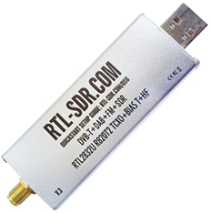

# Lesson 10 --- Tx from PlutoSDR, Rx on RTL-SDR

In the previous lessons, we used the PlutoSDR as both a transmitter and a receiver. Now we will use the PlutoSDR to transmit signals and the RTL-SDR to receive them. Each of these devices has an internal clock, but the clocks are not perfect and they will not be synchronized between the two devices. This means that when one "thinks" it is outputting a pure sine wave at 915 MHz, it may actually produce a wave at 915.001 MHz or 914.9994 MHz or some other slightly shifted frequency. The same goes for the receiver clock which is used to generate the local oscillator that beats with the incoming signal to generate the difference-frequency signal that actually carries the modulation sent by the PlutoSDR. Furthermore, each clock may drift over time, as the device's temperature changes. As we develop this lesson, we should bear in mind that differences between the clocks may introduce unanticipated effects.

The PlutoSDR can transmit at higher frequencies than the RTL-SDR can receive. We have already operated the PlutoSDR at 2.4 GHz and 3.5 GHz. These frequencies are above the [500 kHz -- 1.75 GHz than the RTL-SDR can handle](https://www.rtl-sdr.com/about-rtl-sdr/). A frequency in the industrial, scientific, and medical (ISM) band from 902 to 928 MHz will work with both devices, so that is what we will use. See [allocations of the ultrahigh frequency band](https://en.wikipedia.org/wiki/Ultra_high_frequency){:target="_blank"} for more information on different bands within the UHF range (300 MHz to 3 GHz).

Pay attention to the colored background of parameters. If the background is green, the value has to be an integer. If you run into problems, just surround the expression you have with `int()`.

Variables: center_freq

Sliders: tx_attenuation 0-100, default 10
rf_gain: 0 70, default 10

meaning of sending a constant

Measure the frequency offset between the two clocks; check temperature dependence.

## Equipment

- Analog devices ADALM-PLUTO software-defined radio 

- RTL-SDR

## Directions

## Parameters

| Parameter            | Value or Range               |
| ----------------     | --------------:              |
| sample rate          | 1 MS/s                       |
| tone frequency range | -1 kHz to 1 kHz, default 500 |
| Rx gain              | 0 to 70, default 64          |
| Rx gain mode         | manual                       |
| Pluto LO frequency   | 915 MHz                      |
| Tx attenuation       | 0 to 100, default TBD        |
| audio gain           | 0 to 100, default 50         |

## Filter properties

| Parameter                 | Value or Range          |
| -----------------         | ----------------------: |
| LPF decimation            | 50                      |
| LPF cutoff frequency      | 2 * tone                |
| LPF transition width      | 250 Hz                  |
| LPF window                | Hamming                 |
| BRF low cutoff frequency  | tone - 5 Hz             |
| BRF high cutoff frequency | tone + 5 Hz             |
| BRF transition width      | 5 Hz                    |
| BRF window                | Hamming                 |

[Lesson 10 flow diagram](figs/lesson10-flowdiagram.png)

## Things to explore

Note: *Depending on your hardware, you may find that displaying all the plots causes errors. You may find that disabling ones that arise earlier in the chain that you are not observing frees up enough computing power to avoid the errors.*

Plotting what you are sending and receiving on the same plot: can 

Play with the transmission

OOK from Pluto to RTL-SDR

Making data from various sources: list the data explicitly with a Vector Source
sps = samples per symbol (sets 100 samples per symbol)

How to convert from signal back to bits: amplitude of the complex number. Shows with a constellation plot.

threshold: then keep 1 in N where N is sps

Homework:

transmit other bit patterns
how fast can you go
how far away can you put the transmitter and receiver?