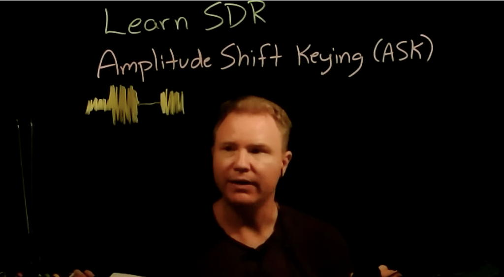
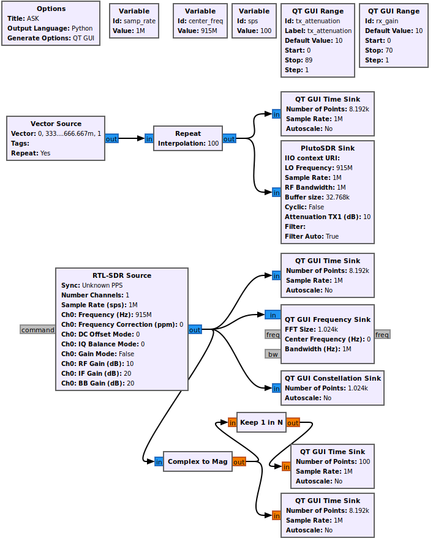
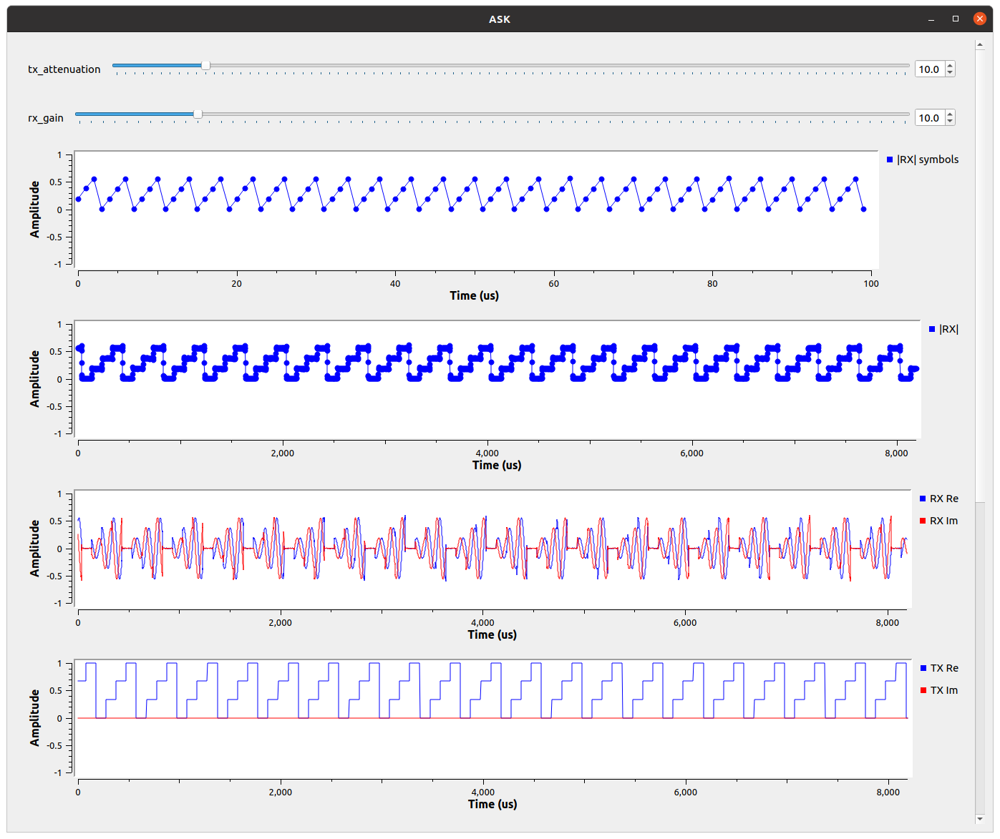
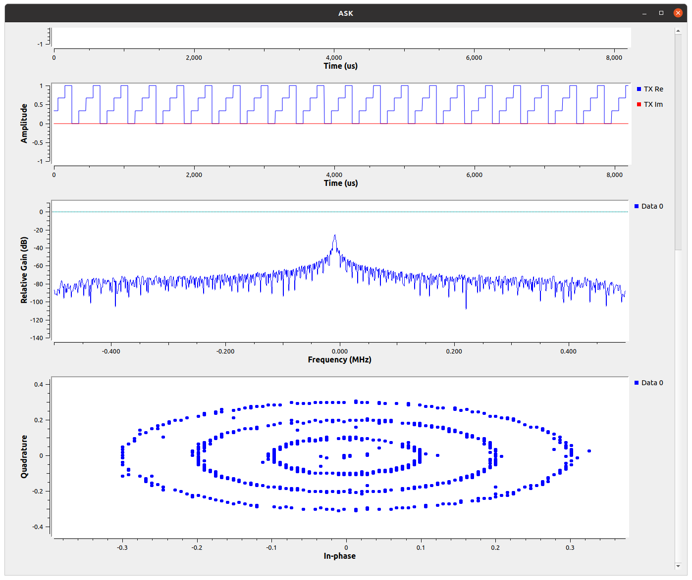

# Lesson 11 --- Amplitude-Shift Keying (ASK) from Pluto to SDR

<iframe width="560" height="315" src="https://www.youtube.com/embed/PJnSFtk_pl4" title="YouTube video player" frameborder="0" allow="accelerometer; autoplay; clipboard-write; encrypted-media; gyroscope; picture-in-picture" allowfullscreen></iframe>

<!-- {:target="_blank"} -->

Last time we used on-off keying as a way of modulating a carrier sinusoidal wave to transmit information. In essence, we used two different levels of signal: 0 and 1. In this lesson, we will use more than two levels to allow a single "pulse" to represent more than a single binary digit.

 Click to expand 

- modulate the amplitude of the complex wave
- Transmit [0.0, 0.25, 0.50, 0.75, 1.0] over and over
- [0.4, 0.8, 1.2, 1.6] is already normalized for Constellation Object and Constellation Decoder
- Time and Constellation plots.
- Symbol: symbols vs bits.
- Samples per symbol (sps)
- How do we set thresholds for decoding? AGC?
- Automated multi-level threshold? Constellation decoder? (Takes complex numbers; too confusing for now.)
- Goal of digital comms is to maximize data rate while minimizing RF bandwidth.
- Noise limits the number of levels (symbols) we can distinguish
- Transmitting more symbols per second increases bandwidth
- Square pulses are incredibly inefficient and they're not the best for doing timing recovery--if you're on a plateau, how do you know whether you should be sampling a little earlier or a little later to hit the center of the symbol.
- HW: For high TX attenuation and low RX gain, where does it get too noisy to cleanly distinguish levels? What can be done to the received digital signals to push that as far as possible (like averaging or filtering).

## Setting up the flow diagram

The plan is to use the Pluto to transmit a signal whose amplitude is modulated in four different levels and to receive that signal in the RTL-SDR. To provide some flexibility, we will use a couple of **QT GUI Range** sliders to adjust the `tx_attenuation` (use 0--89, with a default of 10) and the `rx_gain` (0--70, with a default of 10). In addition we'll define a couple of variables: `center_freq` = 915 MHz and `sps` = 100. I'll explain in a moment what this last one is for. For this flow diagram, set the `samp_rate` to 1 MS/s.

To provide a signal stream with 4 different levels, insert a **Vector Source** block. By default, it just transmits a sequence of zeros, so modify it to use the vector (0, 1/3, 2/3, 1) and set it to repeat. You can choose the numerical format for these values, but it's easiest just to leave them as complex.

To be sure the signal doesn't vary too rapidly, so we can see just what is going on, we will have GNU Radio repeat each value `sps` = 100 times before moving to the next value in the vector. Use a **Repeat** block to accomplish this and set the value of **Samples per symbol** to `sps`. 

In digital communications, a **symbol** is the generalization of a **bit**. In the case we consider here, each symbol has 4 possible values (0, 1/3, 2/3, 1). Each time a new symbol is transmitted, it will be one of these four values (symbols). So, we can transmit two bits at a time.

### Transmit block

Send the output of the repeat block into both a **QT GUI Time Sink** and the **PlutoSDR Sink**, and configure the Pluto to use `center_freq` and `samp_rate`. As you are editing the block, note that the sample rate has a green background, meaning that it needs to be an integer. You can wrap the variable to be sure: `int(samp_rate)`. Also make sure that the transmission attenuation is linked up to your slider. You may want to bump up the number of points used in the time sink by a factor of 8 to produce a smooth output.

### Receive block

Add an **RTL-SDR** block to receive the signal transmitted by the Pluto, along with the usual time and frequency sinks to allow you to see what is being received. Also add a **QT GUI Constellation Sink** to display the Im vs Re values of the received data. What do you expect the constellation plot to look like?

Finally, since we only care about the magnitude of the values we receive, you can send the output of the RTL-SDR into a **Complex to Mag** block to extract the amplitude. Send the output of this to a time sink and also to a **Keep 1 in N** block to extract just one sample for each of the `sps` values that are sent. This should provide a faithful representation of the 4 magnitudes that encode the symbols.

 The ASK flow diagram 

The ASK flow diagram in operation.

## Homework

- For high transmitter attenuation and low signal gain, how weak can you make the received signal before you can no longer reliably distinguish the four levels?

All GNURadio flowgraphs are at [https://github.com/gallicchio/learnSDR](https://github.com/gallicchio/learnSDR)

