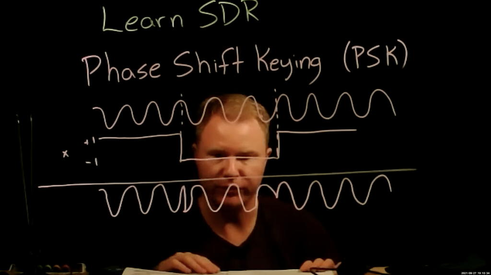

# Lesson 12 --- Phase-Shift Keying (PSK)

Last time, we used a vector of values to modulate the amplitude of the carrier wave, which allowed us to send symbols which could contain more information than a single bit. In **binary phase-shift keying** (BPSK) we multiply the carrier wave either by 1 or -1. It is common to associate the amplitude of 1 with the binary value 0 and the amplitude of -1 to the binary value 1, which has a simple mapping to the binary XOR operator.

<!-- {:target="_blank"}  -->

<iframe width="560" height="315" src="https://www.youtube.com/embed/EHQcuFuQA5w" title="YouTube video player" frameborder="0" allow="accelerometer; autoplay; clipboard-write; encrypted-media; gyroscope; picture-in-picture" allowfullscreen></iframe>

Start with your flow graph from the previous lesson, save a copy with the name BPSK, and then work on the following modifications.

As before, we will use a **Vector Source** to supply a string of values, only this time our input will be a string of binary digits in a pattern that we will repeat over and over. You can pick whatever pattern you like, but it is helpful to pick something that you can readily recognize in the output [e.g., (0,1,0,1,0,0,1,1,1,1)].

To convert this list of symbols into the values 1 and --1 that we will use to encode, use the **Chunks to Symbols** block and provide the values `(1,-1)` as the symbol table.

make the offset range much smaller

need to investigate ways to slowly adjust 

This one didn't work well.

[The finished flow diagram](figs/flow/BPSK-flowdiagram.png){:target="flow"}

## Homework

1. Square the incoming signal to adjust the slider and zero out the frequency difference. 

Next time: adjusting . 
