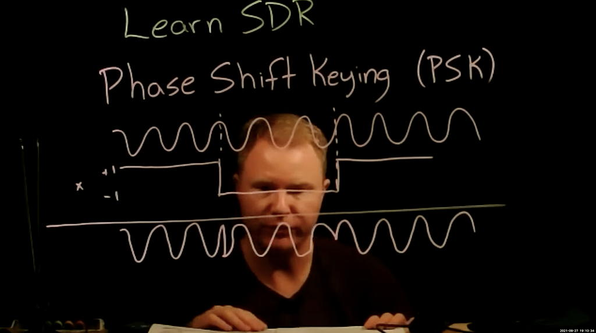

# Lesson 12 --- Phase-Shift Keying (PSK)

Last time, we used a vector of values to modulate the amplitude of the carrier wave, which allowed us to send symbols which could contain more information than a single bit. In **binary phase-shift keying** (BPSK) we multiply the carrier wave either by 1 or -1. It is common to associate the amplitude of 1 with the binary value 0 and the amplitude of -1 to the binary value 1, which has a simple mapping to the binary XOR operator.

{:target="_blank"}

Chunks-to-symbols
Discussion of XOR operation.
PSK

make the offset range much smaller

need to investigate ways to slowly adjust 

This one didn't work well.

Homework:

1. Square the incoming signal to adjust the slider and zero out the frequency difference. 

Next time: adjusting . 