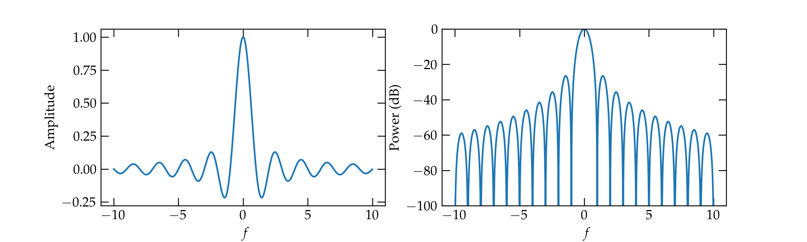
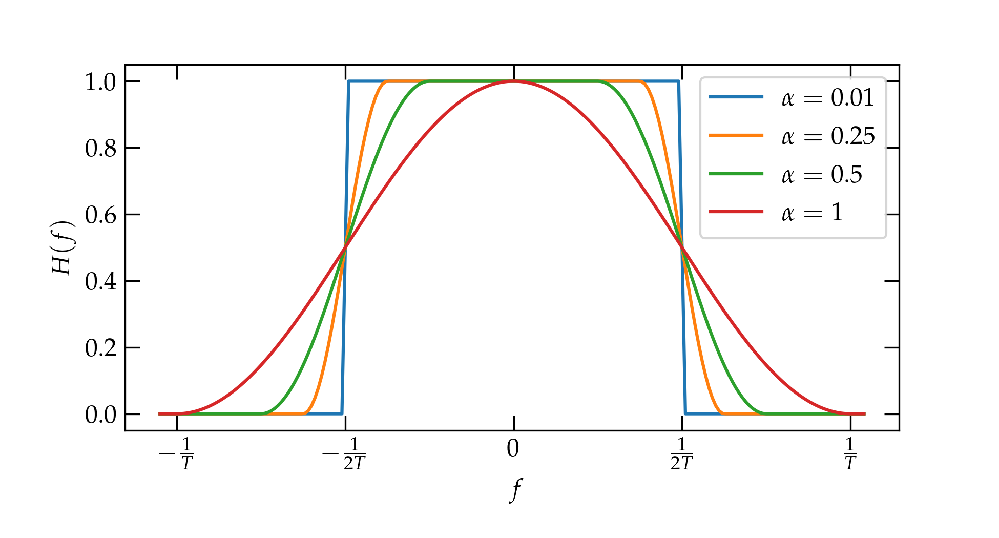
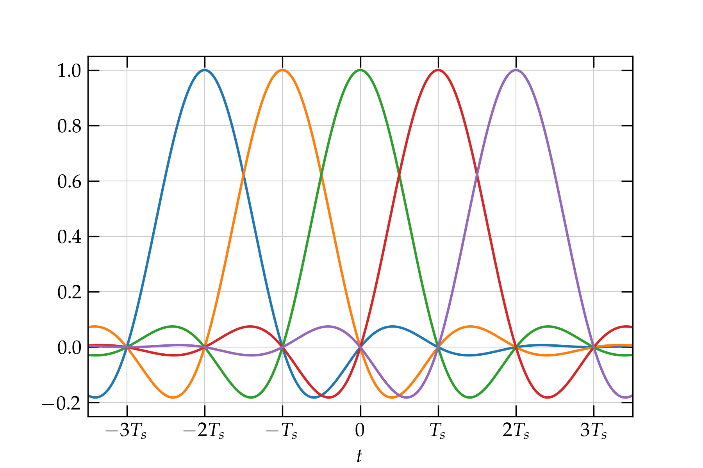

# Lesson 14 --- Pulse Shaping and Nyquist Criteria

<iframe width="560" height="315" src="https://www.youtube.com/embed/JpDVCwJWnHs" title="YouTube video player" frameborder="0" allow="accelerometer; autoplay; clipboard-write; encrypted-media; gyroscope; picture-in-picture" allowfullscreen></iframe>

So far, we have thought of discrete bits of information as square pulses: 0 or 1, which we can map into a phase of 1 or -1 in **binary phase-shift keying**.

  

{:refdef: .mycap}
  **Figure 1** --- In binary phase-shift keying, a string of bits (zeros and ones) is mapped into the values +1 and --1.
{: refdef}

 Unfortunately, sharp transitions in time require enormous bandwidth in frequency, meaning that we make very inefficient use of a precious and finite resource. We now need to spend a bit of time exploring the relationship between signals in the time and frequency domains to see how we can effectively transmit binary information without wasting so much frequency bandwidth.

 Cutting to the chase, the frequency distribution of a square pulse dies out very slowly, as illustrated in the following figure:

  

{:refdef: }
**Figure 2** --- On the left is a **sinc** function, which is the Fourier transform of a unit step impulse. On the right is the same **sinc** function, but this time represented on the logarithmic (decibel) scale. Notice that the frequency spectrum of the pulse has a great many side lobes which die off very slowly. 
{: refdef}

 
 The left figure shows the amplitude as a function of frequency $$f$$ shift with respect to the carrier frequency. The amplitude is a **sinc** function ($$\mathrm{sinc} \,\theta = \frac{\sin\theta}{\theta}$$). The right figure shows the power in decibels, illustrating the very large bandwidth associated with the sudden transitions in binary phase-shift keying.
 

 Details for computing the bandwidth (click to expand) 

When we make an abrupt transition from one phase to another, the carrier wave various **discontinuously**. While this is simple in the time domain---pulses are square and clean---it comes at a great price in frequency bandwidth. Recall the Fourier relation between a pulse in time and its representation in frequency:

\begin{equation}\label{eq:FFT1}
  g(f) = \int_{-\infty}^{\infty} g(t) e^{-i\,2\pi f t} \, dt
\end{equation}
and
\begin{equation}\label{eq:FFT2}
  g(t) = \int_{-\infty}^{\infty} g(f) e^{i\,2\pi f t} \, df
\end{equation}

Consider a signal that is zero everywhere except for a pulse of amplitude 1 from $$-\frac{T_s}{2} < t < \frac{T_s}{2}$$, where $$T_s$$ is the **symbol time**. What does such a pulse look like in the frequency domain, according to Eq. (\ref{eq:FFT1})? As a function of time, it takes the form
\begin{equation}
  g(f) = \frac{\sin(2\pi f T_s)}{2\pi f T_s} T_s
\end{equation}
which peaks at $$f = 0$$ and oscillates with a decaying amplitude on either side. 

If we use a carrier wave of center frequency $$f_0$$ to represent this pulse, the expression above for $$g(f)$$ gets modified to \begin{equation}
g(f) = \frac{\sin[2\pi (f-f_0) T_s]}{2\pi (f-f_0) T_s} T_s = T_s \, \mathrm{sinc}(2\pi f T_s) 
\end{equation}
The function $$\frac{\sin \theta}{\theta}$$ is called $$\mathrm{sinc}(\theta)$$.

  

{:refdef: }
**Figure 3a** --- The parameter $$\alpha$$ determines how rapidly the frequency profile transitions from 0 to 1.
{: refdef}

This spectrum is very broad---it uses way more bandwidth $$\Delta f$$ than the sample period suggests should be necessary: $$\Delta f \approx \frac{1}{T_s}$$.

## Keeping the bandwidth low

If we are willing to tolerate some messiness in the signal as a function of time, we can use a lot less bandwidth, which means that nearby channels won't interfere with one another. In fact, the Fourier-transform relationship between the profile of a signal in time and its profile in frequency is symmetric: if we want a narrow spectrum with sharp cutoffs in frequency, we could use the kind of square shape shown above in top graphs, but then the shape in time would be the slowly decaying **sinc** function. That would be difficult to work with because each bit would stretch a very long time.

The solution is to make the edges not so sharp, which we can do using a _raised cosine_ function to smooth the transition from 0 to 1 and back down, as illustrated below.

  

{:refdef: }
**Figure 3**  --- The parameter $$\alpha$$ determines how rapidly the frequency profile transitions from 0 to 1.
{: refdef}

The **raised cosine** function takes a parameter $$\alpha$$ that describes how suddenly the transition is made: on the positive side it goes from $$\frac{1-\alpha}{2T}$$ to $$\frac{1+\alpha}{2T}$$, and symmetrically on the negative frequency side.

If we use the raised cosine spectra illustrated in the figure, what do the signals (pulses) look like in the time domain? 

  

{:refdef: }
**Figure 4** --- Raised cosine pulse shapes for several different values of $$\alpha$$.
{: refdef}

As expected, the sharper the edge in the spectrum (i.e., the smaller $$\alpha$$), the wider the tails of the pulse in time.

## Nyquist ISI criterion

**Much more importantly**, every pulse shape shares the property of the **sinc** function that the value is zero at every nonzero multiple of the sample time $$T_s$$. This means that a sample pulse centered at $$t = 0$$ and would add nothing to the signal of a pulse that is sent $$t = T_s$$ later. For all signal pulses sent at the regular interval $$T_s$$, every one vanishes at $$t = 0$$ _except_ the one sent at $$t = 0$$. This results in no **intersymbol interference (ISI)**. The **Nyquist ISI criterion** is a demand on the pulse shape $$h(nT_s)$$ that it have the property that
\begin{equation}
   h(n T_s) = \begin{cases}
   1 & n = 0 \\\\  0 & n \ne 0
   \end{cases}
\end{equation}

The **sinc** function,
\begin{equation}
  h(t) = \frac{\sin(\pi t/T_s)}{\pi t/T_s}
\end{equation}
 produced by a sharp bandwidth cutoff satisfies the Nyquist ISI criterion, since the numerator vanishes for all $$t = n T_s$$ for nonzero integer $$n$$. _Crucially_, this property is also true for raised cosine spectra, as illustrated in the figure below for which $$ \alpha = 0.1 $$.

 

   
 

 
 {:refdef: }
 **Figure 5** ---  Raised cosine pulses satisfy the Nyquist ISI criterion. Notice that the only nonzero contribution at $$t = 0$$ comes from the green pulse, whose amplitude there is 1.
 {: refdef}
 

