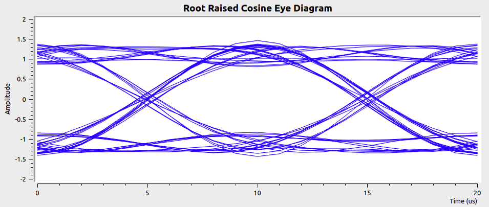
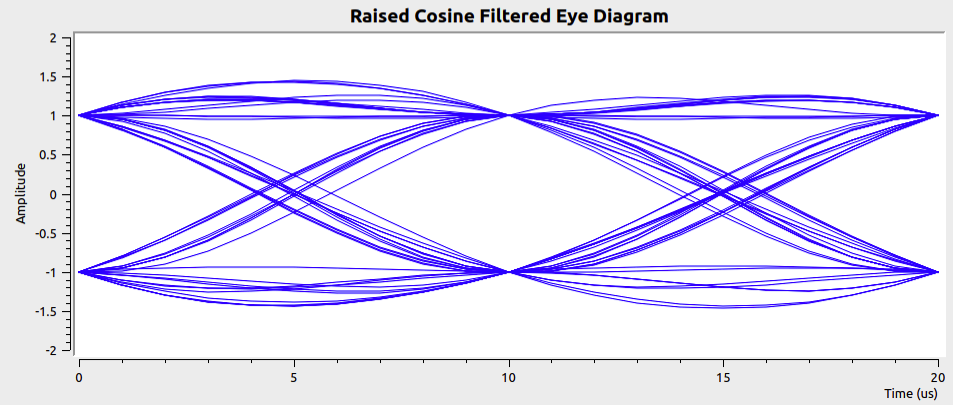
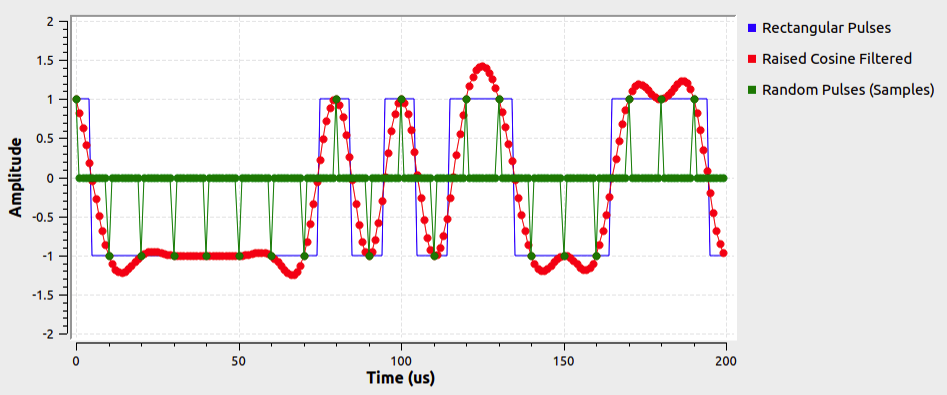
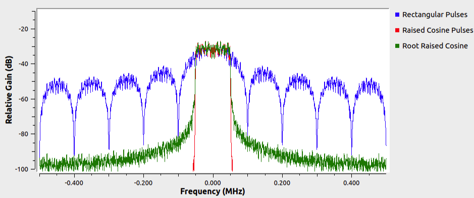

# Lesson 15 --- Pulse Shaping Matched Filter

<iframe width="560" height="315" src="https://www.youtube.com/embed/JeW1HfTGnEE" title="YouTube video player" frameborder="0" allow="accelerometer; autoplay; clipboard-write; encrypted-media; gyroscope; picture-in-picture" allowfullscreen></iframe>

 

Last time we saw that if we use a **raised cosine spectrum** in the frequency domain, the signal in time has the very nice property that the zero crossings of all the adjacent pulses occur at the peak of the "current" pulse you are transmitting. It would seem natural, therefore, that we should use the pulse shape that arises from a raised cosine. However, it turns out that we can achieve a much higher signal-to-noise ratio---when we have to factor in real-world noise---by splitting up the raised cosine filter, applying half on the transmission side and half on the reception side.

## Matched filters

If you pass a noisy signal, whose shape in the absence of noise we know, through a filter that has the same noise-free shape, we will get maximum amplitude for a signal (noisy or otherwise) that passes through the filter with appropriate delay. This is the basic idea of a **matched filter**. So, if we transmit a **root raised cosine** pulse through a matched filter, the output will be large when the two copies align and small when they are offset appreciably in time. The result is an output pulse that has the shape of a **raised cosine**, which is what we wanted.

The [flow diagram](figs/flow/pulse-shaping.png){: target='_blank'} the Prof. Jason describes in the video allows you to explore how the extra bandwidth parameter $$\alpha$$ in the raised cosine spectrum and filter affects the necessary bandwidth, pulse shapes, and eye diagrams. Figure 1 offers an illustration of how the **root raised cosine** shape _has_ intersymbol interference (ISI), but after passing through a matched filter it does _not_ have ISI.

  

  

{:refdef: .mycap}
**Figure 1** --- Eye diagrams for sending random binary digits using the **root raised cosine** shape (upper panel) and after passing the resulting signal through a **root raised cosine matched filter**.
{: refdef}

## Questions

   1. At $$t = 0$$, 10, and 20 $$\mu$$s there are two possible amplitudes, +1 and --1, but in the intervals between these times there are many paths. Why is that?

   2. What would happen to the eye diagrams if you changed the input to come from a **Source Vector** with the value `(0,1,0,1)`? 

   3. Roughly what value of $$\alpha$$ was used to produce these eye diagrams?

   4. Which pulse shape has greater bandwidth, the **root raised cosine** or the **raised cosine**? How significant is the difference?

   5. Explain the green trace in the figure below. 

   6. About what value of $$\alpha$$ was used to produce the figure below? How can you tell? 