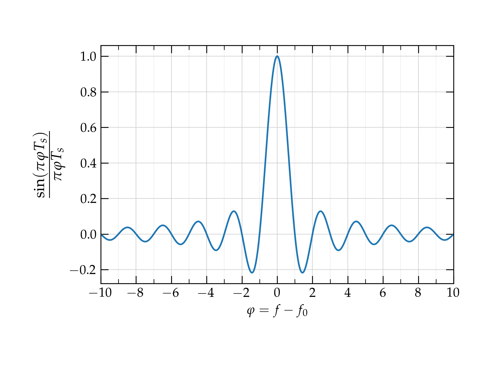

# Lesson 15 --- Pulse Shaping and Nyquist Criteria

So far, we have thought of discrete bits of information as square pulses: 0 or 1, which we can map into a phase of 1 or -1 in **binary phase-shift keying**.

{:refdef: style="text-align: center;"}
{: width="600px;"}
{: refdef}

 Unfortunately, sharp transitions in time require enormous bandwidth in frequency, meaning that we make very inefficient use of a precious and finite resource. We now need to spend a bit of time exploring the relationship between signals in the time and frequency domains to see how we can effectively transmit binary information without wasting so much frequency bandwidth.

 Click to expand 

When we make an abrupt transition from one phase to another, the carrier wave various **discontinuously**. While this is simple in the time domain---pulses are square and clean---it comes at a great price in frequency bandwidth. Recall the Fourier relation between a pulse in time and its representation in frequency:
\begin{equation}\label{eq:FFT1}
  g(f) = \int_{-\infty}^{\infty} g(t) e^{-i\,2\pi f t} \, dt
\end{equation}
and
\begin{equation}\label{eq:FFT2}
  g(t) = \int_{-\infty}^{\infty} g(f) e^{i\,2\pi f t} \, df
\end{equation}

Consider a signal that is zero everywhere except for a pulse of amplitude 1 from $$-\frac{T_s}{2} < t < \frac{T_s}{2}$$, where $$T_s$$ is the **symbol time**. What does such a pulse look like in the frequency domain, according to Eq. (\ref{eq:FFT1})? As a function of time, it takes the form
\begin{equation}
  g(f) = \frac{\sin(2\pi f T_s)}{2\pi f T_s} T_s
\end{equation}
which peaks at $$f = 0$$ and oscillates with a decaying amplitude on either side. 

If we use a carrier wave of center frequency $$f_0$$ to represent this pulse, the expression above for $$g(f)$$ gets modified to \begin{equation}
g(f) = \frac{\sin[2\pi (f-f_0) T_s]}{2\pi (f-f_0) T_s} T_s = T_s \, \mathrm{sinc}(2\pi f T_s) 
\end{equation}
The function $$\frac{\sin \theta}{\theta}$$ is called $$\mathrm{sinc}(\theta)$$.

This spectrum is very broad---it uses way more bandwidth $$\Delta f$$ than the sample period suggests should be necessary: $$\Delta f \approx \frac{1}{T_s}$$.

The reason is the sharp transitions from one state to another. If we could round off the edges of the pulses to make a smooth transition from 1 to 0 or 1 to --1, we would allow the frequency spectrum to die off much more rapidly, requiring much less bandwidth. That's exactly what we'll do, except that instead of thinking about the pulse in time, we will think about the pulse in "frequency space" to have the top-hat shape. By the symmetry of the Fourier transform (Eqs. (1)--(2)), a top-hat shape in frequency will produce a **sinc** function in the time domain.

 but with smoothed edges defined by a half-period of a cosine function to make the transition from 1 to 0. By the symmetry of the Fourier transform, the  

