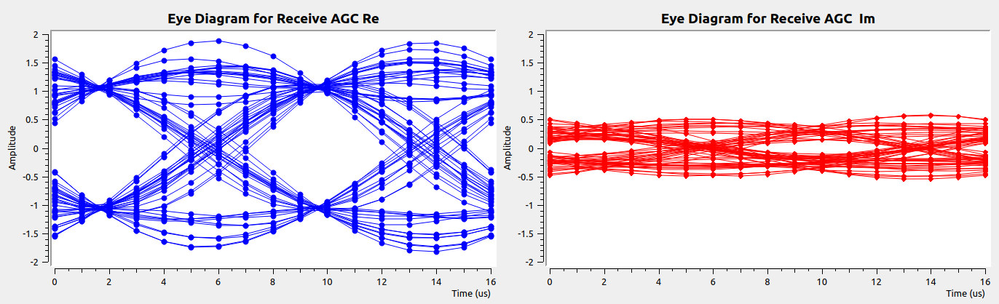

# Lesson 16 --- Constellation Modulator

<iframe width="560" height="315" src="https://www.youtube.com/embed/91veeuSU_IQ" title="YouTube video player" frameborder="0" allow="accelerometer; autoplay; clipboard-write; encrypted-media; gyroscope; picture-in-picture" allowfullscreen></iframe>

We have seen that to transmit data with narrow bandwidth and with no intersymbol interference (ISI), we should transmit **root raised cosine** pulses and pass the received signals through a matched root raised cosine filter---one that uses the same parameters as those used to generate the transmitted pulses. In the previous lesson, these pulses were generated entirely in software. This time we will use the PlutoSDR to transmit and the RTL-SDR to receive the signals, which we further process. The primary steps are

1. Pick the sort of keying we wish to use (BPSK, QPSK, DQPSK, 8PSK, 16QAM, or a variable constellation) and the number of samples per symbol `sps`. For illustration, we will use BPSK and `sps = 16`. In a more realistic application, we might use a value of 2 or 4 for `sps`.

2. Decide on an excess bandwidth parameter `alpha`. We will need to put that value in a variable not a slider, because when the flow diagram starts the value is used to precompute a number of properties of certain blocks that do not get updated if changed while the flow diagram is running.

3. Set up a **Constellation Modulator** to receive the data to transmit and encode it using root raised cosine pulses to be transmitted by the Pluto. Although in this example we will use BPSK, as an illustration of a more general case, suppose we wish to transmit 4 possible values in QPSK. A sensible choice would be the [Gray code](https://en.wikipedia.org/wiki/Gray_code){: target="wiki"} mapping

| input (dec) | Gray code (dec) | Gray code (bin) | output |
| 0 | 0 | 00 | $$-1 - 1j$$ |
| 1 | 1 | 01 | $$-1 + 1j$$ |
| 2 | 3 | 11 | $$1 + 1j$$ |
| 3 | 2 | 10 | $$1 - 1j$$ |

This ordering, which reverses 2 and 3, has the property that in going from one value to the next, only a single binary digit is flipped. For binary phase shift keying, the table is more straightforward

| input (dec) | Gray code (dec) | Gray code (bin) | output |
| 0 | 0 | 00 | $$1$$ |
| 1 | 1 | 01 | $$-1$$ |

There are a couple of challenges. First, the data we send to the Constellation Modulator needs to be assembled in a more efficient form than a sequence of random _bytes_ each of which has only one significant bit (for BPSK). We can manage this with an **Unpacked to Packed** block. The second complication is that we must keep the amplitude of the output within the Pluto's range of acceptance, which is --1 to 1. Since RRC pulses can have peaks that exceed the magnitude of the data we are trying to send, we will need to pass the output through a **Multiply Const** block to make sure not to overflow the Pluto.

4. On the receiving end, we need to correct for the difference in frequency between the transmitter and the receiver. For the moment, we will use a cosine source with a frequency that we can adjust with a slider. Besides using our usual sliders for `TX attenuation` and `RX gain`, we will use an **Automatic gain control** block to adjust the strength of the received signal before passing it through a matched root raised cosine filter to decode the data. Initially, we'll use a number of taps equal to `11*sps`, but you can investigate what happens if you use a different odd number of multiples of `sps`.

[Flow diagram](figs/flow/constellation.png){: target="flow"}

## Questions

1. The flow diagram uses the **arity** of the Constellation Object. What does that mean? What other blocks use this value?

2. The eye diagrams below were obtained after changing a value on the flow diagram. What value was changed and what value does it have here?

## Problems

- With the help of a slider to account for the different clock rates of the Pluto and RTL-SDR, we were able to successfully decode the BPSK data, but as illustrated in the figure above, the results weren't perfect. It was not possible to dynamically adjust the frequency shift to get rid of the slow drift that caused a portion of the signal to appear in the real part of the decoded signal and another in the imaginary part, despite our sending only real values. We will need to develop a method for removing the spectral drift automatically.

- Even were we to perfectly correct for the frequency difference between the Pluto and RTL-SDR clocks, there would be an arbitrary phase difference between them. This difference means that we won't get a sample at the exact right place in the eye diagram and we will need to interpolate between measured values to recover the sent value.

- We will also need to figure out where in the range from 0 to `sps` we need to sample to be at that place on the eye diagram where the values are ideally separated.

We will address these issues in the next few lessons.
