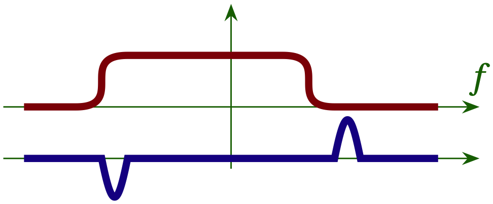

# Lesson 17 --- Frequency Locked Loop (FLL)

<iframe width="560" height="315" src="https://www.youtube.com/embed/jJHnJtcKW0M" title="YouTube video player" frameborder="0" allow="accelerometer; autoplay; clipboard-write; encrypted-media; gyroscope; picture-in-picture" allowfullscreen></iframe>

The first step in automating signal recovery is to correct for the difference in clock rate between the transmitter and receiver. The key insight here is to look at the range of frequencies at the receiver and adjust it to be centered around zero.

To do this, we use a band-edge filter with a positive peak centered on where the correct spectrum is falling off on the positive side and a negative peak where the spectrum falls off on the negative side

{:refdef: .mycap}
**Figure 1** --- The received spectrum in red is not centered around zero frequency. If we multiply by the blue filter and sum, we will get a large negative contribution from the left bump and essentially nothing from the right bump, since the received spectrum effectively vanishes there. The sum is thus negative, telling us that the red curve has been shifted to lower frequency compared to the desired symmetric arrangement.
{: refdef}

## Properties of the Frequency Locked Loop block
- samples per symbol: `sps`
- filter rolloff factor: `alpha`
- prototype filter size: `sps*2+1`
- loop bandwidth: `2 * math.pi / sps / 100`

[Flow diagram](figs/flow/FLL.png){: target='flow'}

## Questions

1. What happens if you change the FLL loop bandwidth by a factor of two?
2. 