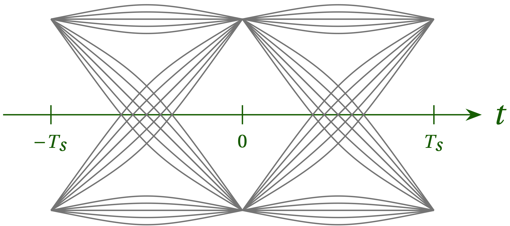
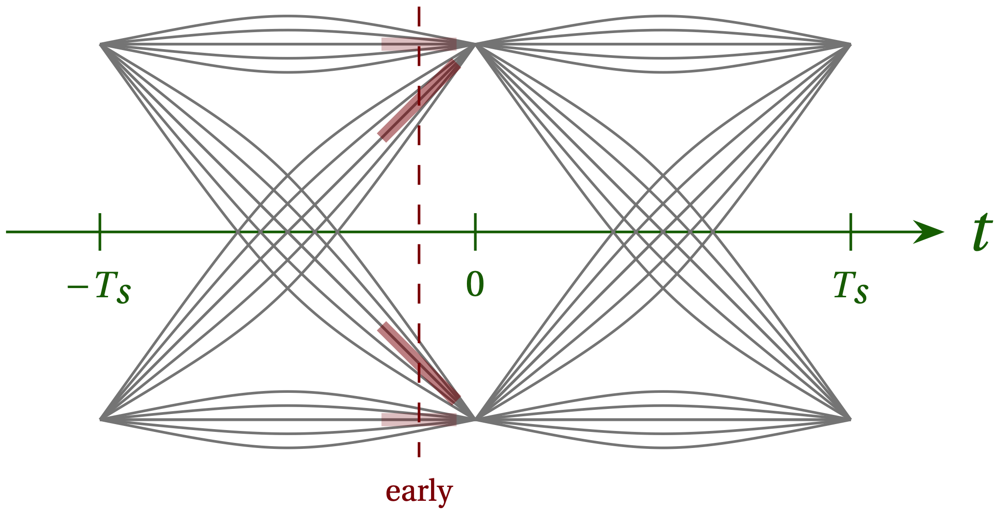
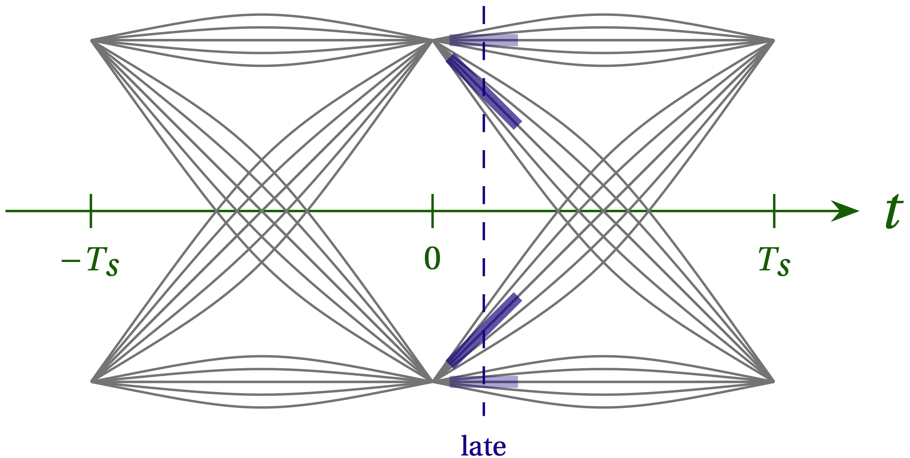

# Lesson 18 --- Symbol Timing Recovery and Synchronization

<iframe width="560" height="315" src="https://www.youtube.com/embed/jag3btxSsig" title="YouTube video player" frameborder="0" allow="accelerometer; autoplay; clipboard-write; encrypted-media; gyroscope; picture-in-picture" allowfullscreen></iframe>

Even if the clocks in the transmitter and receiver happened to have exactly the same frequency, they will inevitably have an arbitrary phase offset, which means that sampling at the receiver won't line up with the symbol times on the transmitter. So, after using the **automatic gain controller** to get the signal level right and the frequency-locked loop to perform the gross frequency correction, we now have to correct for the slowly drifting phase offset, interpolate between samples to sample effectively at the moment when the no ISI property of the raised-cosine pulses allows us to measure the current pulse without contamination from the other pulses, and then correct for an absolute phase offset.

## Strategy

The primary problem we will address in this lesson is determining the proper timing of the symbol. Imagine that we use four samples per symbol, so we sample at four equally spaced times during the symbol pulse. Because clocks drift, the odds that we will have one of these samples at the proper time are vanishingly small. We need to interpolate between samples to "read" the symbol at the optimum time. How can we do this?

The strategy we will employ takes full advantage of the **Nyquist-Shannon sampling theorem**. Recall the gist of this important insight: provided that we sample _a bandwidth-limited signal_ at or above its Nyquist frequency---meaning that we take at least two samples per cycle of the maximum frequency that is present in the signal---**the discrete samples have all the information needed to perfectly reconstruct the continuous signal.** Amazing but true!

So, how do we use this theorem to our advantage here? We will use a strategy that allows us to precompute a number of filters that will interpolate at many places in the symbol and use an error signal to select the best filter to use. Even better, the filters will apply a root-raised-cosine filter so that the output of the filter is the time-shifted and corrected signal that most closely corresponds to the symbol that was original transmitted.

To develop an error signal we can use to home in on the correct timing, consider the eye diagram shown in Fig. 1. Precisely at the time marked 0, the intersymbol interference disappears and only the values +1 and --1 will be measured. Unfortunately, we may be sampling a bit before this time or a bit after.

**Figure 1** --- Schematic illustration of the paths in an eye diagram for binary phase-shift keying. To keep bandwidth modest, each symbol extends many periods before and after the symbol we wish to transmit, which leads to many different paths for transition from the previous symbol at either --1 or +1 to the next (also at either --1 or +1).

Consider what happens if we sample a bit too early, as illustrated in Fig. 2. The product of the signal value $$x$$ and its time derivative $$\dot{x}$$ (the slope) is positive for both transition from --1 to +1 and from +1 to --1. If we take the average of $$x \dot{x}$$ across all paths, we will get a positive value that indicates we should shift our timing a bit later.

**Figure 2** --- When we sample too early (at the time indicated by the vertical dashed line), we can learn something from the two sloped paths that represent transitions from +1 to --1 and from --1 to +1. The product of the signal value $$x$$ and its time derivative $$\dot{x}$$ (the slope) is positive for **both types of transition**.

We can make a similar deduction for the case when we sample a bit too late, as illustrated in Fig. 3.

**Figure 3** --- When we sample too early (at the time indicated by the vertical dashed line), we can learn something from the two sloped paths that represent transitions from +1 to --1 and from --1 to +1. The product $$x \dot{x}$$ is negative for **both types of transition**.

So, we will take
\begin{equation}
  e = \langle x \dot{x} \rangle
\end{equation}
to yield an error signal we can use to adjust the sample timing, where the angle brackets indicate a time average. For this signal, the roughly horizontal paths that represent two consecutive symbols of the same value contribute nothing on average, but the two diagonal paths produce a signal that grows larger the farther from the correct timing we are and is positive when we need to move later and negative when we need to move earlier. Note, however, that **we need data that has transitions.** Without them, the error signal disappears.

_It is not clear to me why $$\langle \mathrm{sign}(x) \dot{x} \rangle$$ should be linear with timing error, however, since the slope along the diagonal paths is roughly constant._

<!-- Plot of the error is called the S curve. -->

Armed with this error signal, we now face several challenges:

- How do you compute the derivative with sparse samples?
- How do you interpolate?
- How do you use the error signal to move closer to the right timing?

As is our custom, we will use convolution by digital filters to manage the first two of these tasks. First, we will apply a root-raised-cosine filter to the raw data $$r$$ to produce the signal $$x$$:
\begin{equation}
  x = r * p_{\rm\scriptsize RRC}
\end{equation}

To get the derivative, we could use a derivative filter

\begin{equation}
 \dot{x} = x * d = (r * p_{\rm\scriptsize RRC}) * d = r * (p_{\rm\scriptsize RRC} * d)
\end{equation}

To interpolate, we leverage the Nyquist-Shannon sampling theorem and upsample the signal by spacing each real value in $$r$$ with $$N - 1 = 31$$ zeros and then passing the result through an appropriate low-pass filter to produce the smoothed output. In fact, we'll generate a bank of $$N$$ filters, each designed to interpolate at a different place between the original samples of $$r$$. This is called a **polyphase filter bank**.

[Flow diagram](figs/flow/polyphase.png){: target='flow'}
