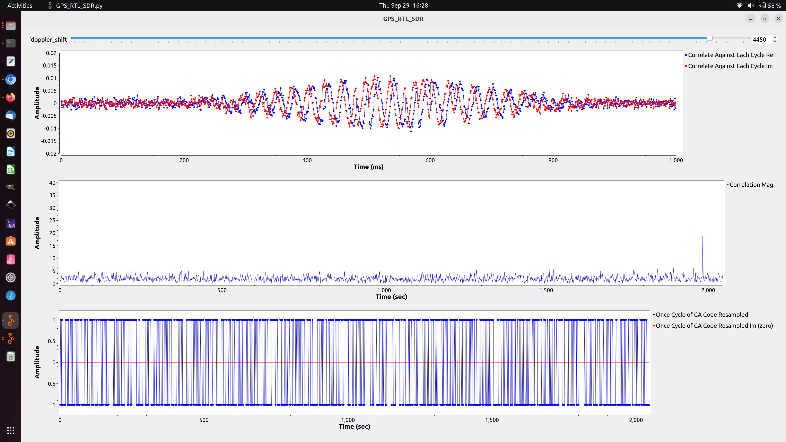
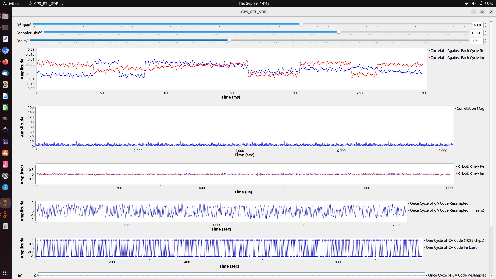

# Lesson 23 --- GPS Reception

I use an RTL-SDR and a cheap GPS antenna to see some some of the Global Positioning System (GPS) satellite transmissions.

<iframe width="560" height="315" src="https://www.youtube.com/embed/4YO1XSVMtqI" title="YouTube video player" frameborder="0" allow="accelerometer; autoplay; clipboard-write; encrypted-media; gyroscope; picture-in-picture" allowfullscreen></iframe>

The GPS reference used to find the taps for the C/A code is [http://www.naic.edu/~phil/rfi/gps/AFD-070803-059-1.pdf].

GPS correlation and demodulation in operation:

A more sophisticated result with better fine-tuning of the carrier offset:

All GNURadio flowgraphs are at [https://github.com/gallicchio/learnSDR](https://github.com/gallicchio/learnSDR)

